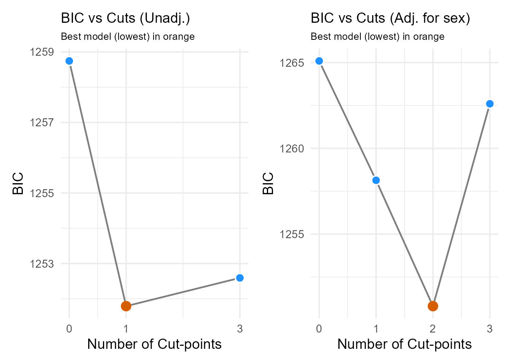
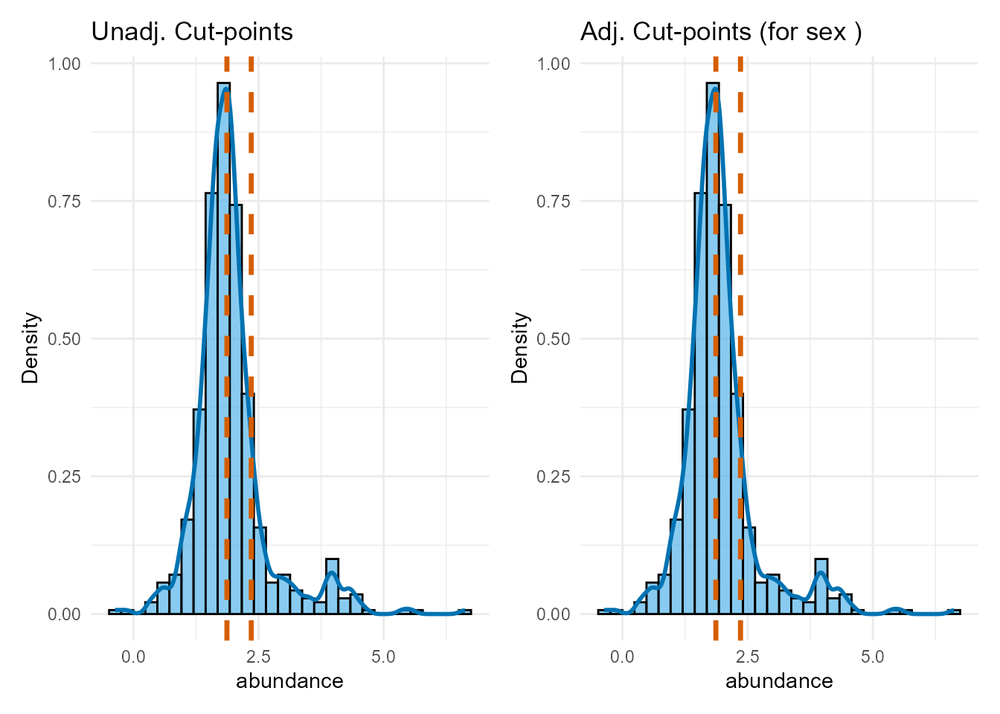
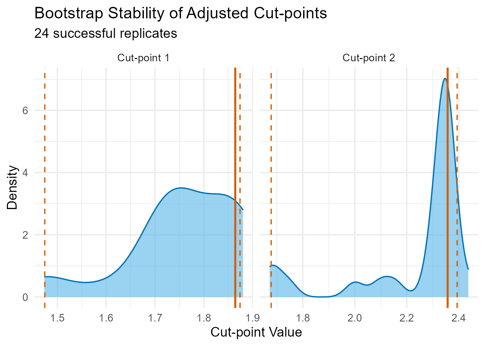
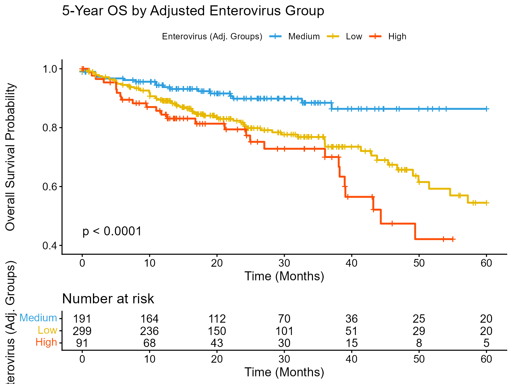
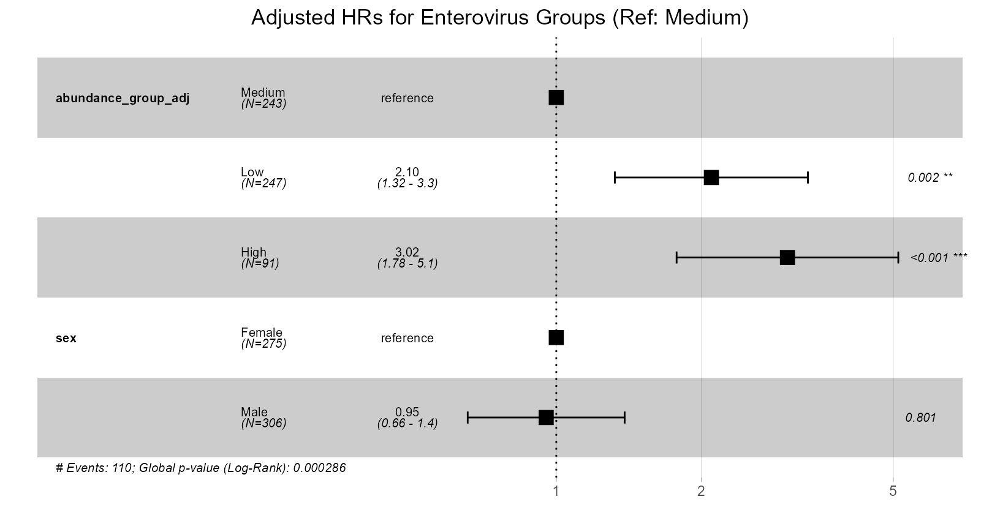
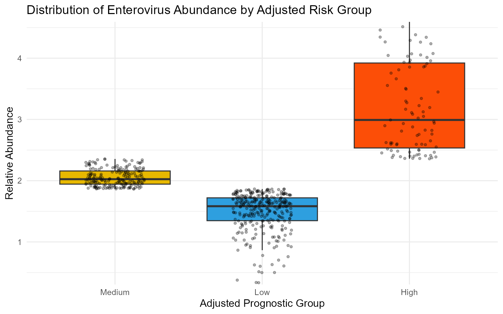
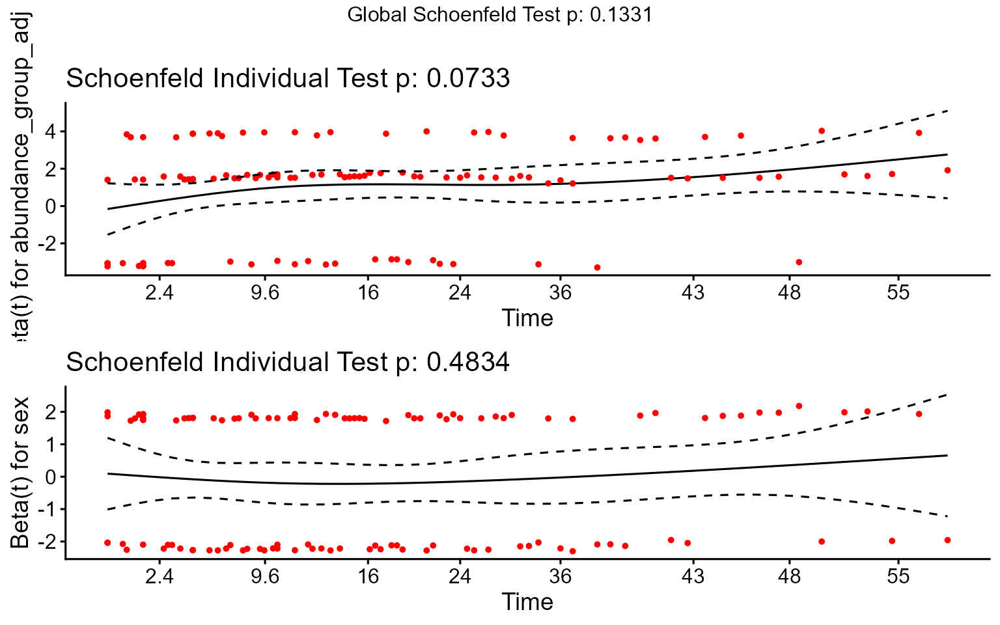

# Stratifying Colorectal Cancer Patients by Gut Enterovirus Abundance

#### About the Package

The **`OptSurvCutR`** package provides a comprehensive, data-driven
workflow for survival analysis, specifically designed for scenarios
where a single cut-point is not sufficient. Its core functionality is to
discover and validate one or more optimal cut-points for continuous
variables in time-to-event data. A key feature is the ability to perform
these analyses while adjusting for covariates, allowing assessment of a
biomarker’s independent prognostic value.

This vignette focuses on demonstrating this covariate adjustment
feature.

## Introduction

This tutorial demonstrates how to use the **`OptSurvCutR`** package to
stratify patients into prognostic groups based on a continuous
biomarker, specifically showing how to adjust for potential confounding
variables.

#### The Scientific Background

The human gut virome, the collection of viruses in the gut, can be
disrupted (dysbiosis) in diseases like colorectal cancer (CRC). We will
analyse gut virome data to determine if the relative abundance of the
genus Enterovirus can predict 5-year overall survival, considering
potential confounders like patient sex. This analysis, inspired by data
from [Smyth et al. (2024)](https://doi.org/10.1002/cam4.70434), uses
`OptSurvCutR` to identify data-driven thresholds for Enterovirus
abundance both with and without adjustment for covariates.

#### Analysis Workflow

This guide covers a complete and robust workflow:

1.  **Setup and Configuration**: Preparing the R environment and
    defining key parameters.
2.  **Data Loading and Preparation**: Loading the package’s built-in
    datasets and preparing them for analysis.
3.  **Optimal Cut-point Discovery (Unadjusted vs. Adjusted)**:

- Step 3.1: Determine the optimal number of groups (unadjusted and
  adjusted).
- Step 3.2: Find the cut-point locations (unadjusted and adjusted).

4.  **Cut-point Validation**: Assess the stability of the discovered
    thresholds via bootstrapping.
5.  **Visualisation and Interpretation**: Create and interpret
    Kaplan-Meier curves, forest plots, and other key visualisations.
6.  **Model Diagnostics**: Checking the assumptions of the survival
    model.

------------------------------------------------------------------------

### 1. Setup and Configuration

#### Loading Libraries

First, we load all the necessary R packages.

``` r
# Load all necessary libraries for the analysis.
library(OptSurvCutR)
#> 
#> Attaching package: 'OptSurvCutR'
#> The following object is masked from 'package:base':
#> 
#>     %||%
library(dplyr)
#> 
#> Attaching package: 'dplyr'
#> The following objects are masked from 'package:stats':
#> 
#>     filter, lag
#> The following objects are masked from 'package:base':
#> 
#>     intersect, setdiff, setequal, union
library(survival)
library(survminer) # For ggsurvplot, ggforest, ggcoxzph
#> Loading required package: ggplot2
#> Loading required package: ggpubr
#> 
#> Attaching package: 'survminer'
#> The following object is masked from 'package:survival':
#> 
#>     myeloma
library(patchwork) # For combining plots
library(ggplot2)
library(knitr) # For kable()
library(cli) # For enhanced messsexs
```

#### Defining Parameters

We define the name of the microbe/virus we wish to analyse upfront.
Here, we selected Enterovirus - a RNA virus within the Picornaviridae
family, known for causing gastroenteritis and other infections. We
included the covariates in the adjusted analysis.

``` r
# Define the biomarker of interest.
microbe_name_to_analyze <- "Enterovirus"

# Define covariates available in the crc_virome dataset
covariates_to_adjust_for <- c("sex")

# Set to TRUE if either building the pkgdown site OR running interactively.
# This will be FALSE only for non-interactive builds (like CRAN).
run_parallel_locally <- (Sys.getenv("PKGDOWN") == "TRUE") || interactive()
```

------------------------------------------------------------------------

### 2. Data Loading and Preparation

We load the pre-cleaned clinical and virome dataset directly from the
`OptSurvCutR` package. With the updated data format, this is now a
single data frame. We will process it to extract the necessary columns,
parse the survival status, and censor the data at 5 years (60 months)
for this analysis.

``` r
# Load the single, wide-format data frame from the package.
data("crc_virome", package = "OptSurvCutR")

# --- Prepare the final analysis data frame ---
analysis_data <- crc_virome %>%
  # Select and rename key columns
  select(
    patient_id = sample_id,
    time_months,
    status_char = status, # Original character status (e.g., "0:LIVING")
    abundance = all_of(microbe_name_to_analyze),
    all_of(covariates_to_adjust_for) # Include covariates
  ) %>%
  # Apply 5-year (60-month) censoring and parse status
  mutate(
    # 1. Parse numeric status (0/1) from the character string
    status_numeric = as.numeric(substr(status_char, 1, 1)),

    # 2. Apply censoring: events after 60 months are set to 'censored' (0)
    status_final = ifelse(time_months > 60, 0, status_numeric),

    # 3. Cap all follow-up times at 60 months
    time_final = pmin(time_months, 60)
  ) %>%
  # Select final columns for analysis
  select(
    patient_id,
    time = time_final,
    status = status_final, # Use the new 5-year censored status
    abundance,
    all_of(covariates_to_adjust_for)
  ) %>%
  # Remove rows with any missing values in essential columns
  filter(complete.cases(time, status, abundance, across(all_of(covariates_to_adjust_for))))

# Display the head of the final processed data
head(analysis_data)
#>        patient_id      time status abundance    sex
#> 1 TCGA-3L-AA1B-01 15.616267      0  3.663065 Female
#> 2 TCGA-4N-A93T-01  4.799947      0  1.697278   Male
#> 3 TCGA-4T-AA8H-01 12.657396      0  2.809707 Female
#> 4 TCGA-5M-AAT4-01  1.610941      1  1.688483   Male
#> 5 TCGA-5M-AAT6-01  9.534142      1  2.621937 Female
#> 6 TCGA-5M-AATE-01 39.451622      0  2.378831   Male
```

------------------------------------------------------------------------

### 3. Optimal Cut-point Discovery (Unadjusted vs. Adjusted)

**A Note on Reproducibility (seed)**: Functions involving the genetic
algorithm (`method = "genetic"`) or bootstrapping (`validate_cutpoint`)
use random processes. We set the seed argument to ensure results are
reproducible.

#### Step 3.1: Determine the Optimal Number of Cut-points

We first run
[`find_cutpoint_number()`](https://paytonyau.github.io/OptSurvCutR/reference/find_cutpoint_number.md)
without covariates, then with covariates, to see if adjustment changes
the suggested number of groups. We use BIC and the genetic algorithm
(checking if `rgenoud` is available).

``` r
# --- Unadjusted Analysis ---
number_result_unadj <- find_cutpoint_number(
  data = analysis_data,
  predictor = "abundance",
  outcome_time = "time",
  outcome_event = "status",
  method = "genetic",
  criterion = "BIC",
  max_cuts = 4, # Test 0-3 cuts
  nmin = 0.15, # Min 15% per group
  use_parallel = run_parallel_locally, # Set FALSE for CRAN only
  n_cores = 6,
  seed = 42
)
#> ℹ nmin 0.15 is a proportion. Min. group size set to 88.
#> ℹ Finding optimal cut number: method = genetic
#> ℹ Running genetic algorithm for 1 cut-point(s)...
#> ℹ Running genetic algorithm for 2 cut-point(s)...
#> ℹ Running genetic algorithm for 3 cut-point(s)...
#> ℹ Running genetic algorithm for 4 cut-point(s)...
#> No valid cut-points found for 4 cut(s) due to genetic algorithm failure or
#> constraints.
#> 
#> 
#> ── Optimal Cut-point Number Analysis ───────────────────────────────────────────
#> 
#> Method: genetic
#> 
#> Criterion: BIC
#>  num_cuts     BIC Delta_BIC BIC_Weight    Evidence             cuts
#>         0 1258.74     14.22       0.1%     Minimal               NA
#>         1 1251.79      7.27       2.3%     Minimal             2.36
#>         2 1244.53      0.00      88.9% Substantial       1.86, 2.36
#>         3 1249.18      4.65       8.7%    Moderate 1.61, 1.86, 2.36
#>         4      NA        NA        NA%        <NA>               NA
#> ✔ Conclusion: 2 cut-point(s) is best based on BIC.
#> Optimal cuts at: 1.86 and 2.36
#> Hint: Use `summary()` for details, `plot()` to visualize.
```

``` r
# --- Adjusted Analysis ---
number_result_adj <- find_cutpoint_number(
  data = analysis_data,
  predictor = "abundance",
  outcome_time = "time",
  outcome_event = "status",
  method = "genetic",
  criterion = "BIC",
  max_cuts = 4, # Test 0-3 cuts
  nmin = 0.15,
  covariates = covariates_to_adjust_for, # ADDED COVARIATES
  use_parallel = run_parallel_locally, # Set FALSE for CRAN only
  n_cores = 6,
  seed = 43 # Use a different seed
)
#> ℹ nmin 0.15 is a proportion. Min. group size set to 88.
#> ℹ Finding optimal cut number: method = genetic
#> ℹ Running genetic algorithm for 1 cut-point(s)...
#> ℹ Running genetic algorithm for 2 cut-point(s)...
#> ℹ Running genetic algorithm for 3 cut-point(s)...
#> ℹ Running genetic algorithm for 4 cut-point(s)...
#> No valid cut-points found for 4 cut(s) due to genetic algorithm failure or
#> constraints.
#> 
#> 
#> ── Optimal Cut-point Number Analysis ───────────────────────────────────────────
#> 
#> Method: genetic
#> 
#> Criterion: BIC
#> 
#> Covariates: sex
#>  num_cuts     BIC Delta_BIC BIC_Weight    Evidence             cuts
#>         0 1265.10     14.29       0.1%     Minimal               NA
#>         1 1258.14      7.34       2.2%     Minimal             2.36
#>         2 1250.80      0.00        88% Substantial       1.86, 2.36
#>         3 1255.21      4.41       9.7%    Moderate 1.42, 1.86, 2.36
#>         4      NA        NA        NA%        <NA>               NA
#> ✔ Conclusion: 2 cut-point(s) is best based on BIC.
#> Optimal cuts at: 1.86 and 2.36
#> Hint: Use `summary()` for details, `plot()` to visualize.
```

``` r
plot_num_unadj <- plot(number_result_unadj) +
  ggtitle("BIC vs Cuts (Unadj.)") +
  theme(plot.title = element_text(size = 14))

plot_num_adj <- plot(number_result_adj) +
  ggtitle(paste0(
    "BIC vs Cuts (Adj. for ",
    paste(covariates_to_adjust_for, collapse = ", "), ")"
  )) +
  theme(plot.title = element_text(size = 14))

# Show plots side-by-side
print(plot_num_unadj + plot_num_adj)
```

 \>
**Interpretation:** We compare the BIC plots and optimal number of cuts
from both the unadjusted and adjusted analyses. In this example, both
might suggest 2 cut-points (3 groups) remain optimal even after
adjusting for sex. If the optimal number changed significantly after
adjustment, it might suggest the biomarker’s grouping effect is partly
confounded. We proceed using the optimal number suggested by the
adjusted analysis.

#### Step 3.2: Find the Location of the Cut-points

Now that we have decided to use two cut-points, we use
[`find_cutpoint()`](https://paytonyau.github.io/OptSurvCutR/reference/find_cutpoint.md)
to identify their optimal values based on the log-rank statistic.

``` r
# Determine optimal number for subsequent steps based on unadjusted result
optimal_n_cuts_unadj <- number_result_unadj$optimal_num_cuts # Store unadjusted for comparison

# --- Unadjusted Analysis ---
cutpoint_result_unadj <- find_cutpoint(
  data = analysis_data,
  predictor = "abundance",
  outcome_time = "time",
  outcome_event = "status",
  method = "genetic",
  criterion = "logrank",
  num_cuts = optimal_n_cuts_unadj,
  nmin = 0.15,
  seed = 123
)
#> ℹ nmin 0.15 is a proportion. Min. group size set to 87.
#> ℹ Starting genetic search for 2 cut(s) using 'logrank' criterion...
#> 
#> ── Optimal Cut-point Analysis for Survival Data (Genetic) ──────────────────────
#> • Predictor: abundance
#> • Criterion: logrank
#> • Optimal Log-Rank Statistic: 19.7009
#> ✔ Recommended Cut-point(s): 1.868 and 2.355

print(summary(cutpoint_result_unadj))
#> 
#> ── Optimal Cut-point Analysis for Survival Data (Genetic) ──────────────────────
#> 
#> ── Group Counts ──
#> 
#>   Group   N Events
#> 1    G1 303     64
#> 2    G2 187     18
#> 3    G3  91     28
#> ── Median Survival by Group ──
#> Call: survfit(formula = survival::Surv(time, event) ~ group, data = data)
#> 
#>            n events median 0.95LCL 0.95UCL
#> group=G1 303     64     NA    54.6      NA
#> group=G2 187     18     NA      NA      NA
#> group=G3  91     28   44.3    39.0      NA
#> ── Final Cox Model Summary ──
#> Call:
#> survival::coxph(formula = as.formula(formula_str), data = data)
#> 
#>   n= 581, number of events= 110 
#> 
#>            coef exp(coef) se(coef)      z Pr(>|z|)   
#> groupG2 -0.8728    0.4178   0.2669 -3.271  0.00107 **
#> groupG3  0.4039    1.4976   0.2268  1.781  0.07493 . 
#> ---
#> Signif. codes:  0 '***' 0.001 '**' 0.01 '*' 0.05 '.' 0.1 ' ' 1
#> 
#>         exp(coef) exp(-coef) lower .95 upper .95
#> groupG2    0.4178     2.3936    0.2476    0.7049
#> groupG3    1.4976     0.6677    0.9602    2.3358
#> 
#> Concordance= 0.591  (se = 0.027 )
#> Likelihood ratio test= 20.66  on 2 df,   p=3e-05
#> Wald test            = 18.08  on 2 df,   p=1e-04
#> Score (logrank) test = 19.69  on 2 df,   p=5e-05
#> ── Proportional Hazards Assumption Test ──
#>        chisq df    p
#> group   4.43  2 0.11
#> GLOBAL  4.43  2 0.11
#> ── Analysis Parameters ─────────────────────────────────────────────────────────
#> • Search Method: Genetic
#> • Predictor: abundance
#> • Number of cuts: 2
#> • Minimum group size (nmin): 0.15
#> 
#> ── Optimal Cut-point Analysis for Survival Data (Genetic) ──────────────────────
#> • Predictor: abundance
#> • Criterion: logrank
#> • Optimal Log-Rank Statistic: 19.7009
#> ✔ Recommended Cut-point(s): 1.868 and 2.355

optimal_cuts_unadj_values <- cutpoint_result_unadj$optimal_cuts
```

``` r
# Determine optimal number for subsequent steps based on ADJUSTED result
optimal_n_cuts_adj <- number_result_adj$optimal_num_cuts

# --- Adjusted Analysis ---
cutpoint_result_adj <- find_cutpoint(
  data = analysis_data,
  predictor = "abundance",
  outcome_time = "time",
  outcome_event = "status",
  method = "genetic",
  criterion = "logrank",
  num_cuts = optimal_n_cuts_adj,
  nmin = 0.15,
  covariates = covariates_to_adjust_for,
  seed = 124 # Different seed
)
#> ℹ nmin 0.15 is a proportion. Min. group size set to 87.
#> ℹ Starting genetic search for 2 cut(s) using 'logrank' criterion...
#> 
#> ── Optimal Cut-point Analysis for Survival Data (Genetic) ──────────────────────
#> • Predictor: abundance
#> • Criterion: logrank
#> • Optimal Log-Rank Statistic: 23.7805
#> ✔ Recommended Cut-point(s): 1.864 and 2.357

print(summary(cutpoint_result_adj))
#> 
#> ── Optimal Cut-point Analysis for Survival Data (Genetic) ──────────────────────
#> 
#> ── Group Counts ──
#> 
#>   Group   N Events
#> 1    G1 299     64
#> 2    G2 191     18
#> 3    G3  91     28
#> ── Median Survival by Group ──
#> Call: survfit(formula = survival::Surv(time, event) ~ group, data = data)
#> 
#>            n events median 0.95LCL 0.95UCL
#> group=G1 299     64     NA    51.5      NA
#> group=G2 191     18     NA      NA      NA
#> group=G3  91     28   44.3    39.0      NA
#> ── Final Cox Model Summary ──
#> Call:
#> survival::coxph(formula = as.formula(formula_str), data = data)
#> 
#>   n= 581, number of events= 110 
#> 
#>             coef exp(coef) se(coef)      z Pr(>|z|)    
#> groupG2 -0.91772   0.39943  0.26707 -3.436  0.00059 ***
#> groupG3  0.38680   1.47226  0.22677  1.706  0.08807 .  
#> sexMale -0.05709   0.94451  0.19124 -0.299  0.76530    
#> ---
#> Signif. codes:  0 '***' 0.001 '**' 0.01 '*' 0.05 '.' 0.1 ' ' 1
#> 
#>         exp(coef) exp(-coef) lower .95 upper .95
#> groupG2    0.3994     2.5036    0.2367    0.6742
#> groupG3    1.4723     0.6792    0.9440    2.2962
#> sexMale    0.9445     1.0588    0.6493    1.3740
#> 
#> Concordance= 0.594  (se = 0.029 )
#> Likelihood ratio test= 22.04  on 3 df,   p=6e-05
#> Wald test            = 19.02  on 3 df,   p=3e-04
#> Score (logrank) test = 20.83  on 3 df,   p=1e-04
#> ── Proportional Hazards Assumption Test ──
#>        chisq df    p
#> group  4.571  2 0.10
#> sex    0.436  1 0.51
#> GLOBAL 4.884  3 0.18
#> ── Analysis Parameters ─────────────────────────────────────────────────────────
#> • Search Method: Genetic
#> • Predictor: abundance
#> • Number of cuts: 2
#> • Minimum group size (nmin): 0.15
#> • Covariates: sex
#> 
#> ── Optimal Cut-point Analysis for Survival Data (Genetic) ──────────────────────
#> • Predictor: abundance
#> • Criterion: logrank
#> • Optimal Log-Rank Statistic: 23.7805
#> ✔ Recommended Cut-point(s): 1.864 and 2.357

optimal_cuts_adj_values <- cutpoint_result_adj$optimal_cuts
```

``` r
# Plot comparison
plot_dist_unadj <- plot(cutpoint_result_unadj,
  type = "distribution"
) +
  ggtitle("Unadj. Cut-points")

plot_dist_adj <- plot(cutpoint_result_adj,
  type = "distribution"
) +
  ggtitle(paste(
    "Adj. Cut-points (for",
    paste(covariates_to_adjust_for, collapse = ", "), ")"
  ))

print(plot_dist_unadj + plot_dist_adj)
```



> **Interpretation**: We compare the optimal cut-point locations found
> with and without covariate adjustment. If the cut-points shift
> substantially after adjustment, it suggests the covariates influenced
> the optimal thresholds. If they remain similar, it strengthens the
> evidence for the biomarker’s independent grouping effect. We will use
> the adjusted cut-points for the subsequent validation and final
> modeling.

------------------------------------------------------------------------

### 4. Cut-point Validation

This is a crucial step to assess how reliable our discovered cut-points
are. We use
[`validate_cutpoint()`](https://paytonyau.github.io/OptSurvCutR/reference/validate_cutpoint.md)
to run a **bootstrap analysis**. This re-runs the
[`find_cutpoint()`](https://paytonyau.github.io/OptSurvCutR/reference/find_cutpoint.md)
algorithm many times on resampled data to see how much the optimal
cut-points vary.

``` r
# Set to TRUE if either building the pkgdown site OR running interactively.
# This will be FALSE only for non-interactive builds (like CRAN).
run_parallel_locally <- (Sys.getenv("PKGDOWN") == "TRUE") || interactive()

validation_result_adj <- validate_cutpoint(
  cutpoint_result = cutpoint_result_adj, # Use ADJUSTED result
  num_replicates = 25, # REDUCED for vignette speed; use >= 500
  use_parallel = run_parallel_locally, # Set FALSE for CRAN only
  n_core = 6,
  seed = 456
  # Note: validate_cutpoint implicitly uses the covariates from cutpoint_result_adj
)
#> ℹ Using random seed 456 for reproducibility.
#> ℹ Bootstrap `nmin` not set, defaulting to: 78
#> ℹ Validating 2 cut(s) from 'genetic' search using 'logrank'.
#> ℹ Running 25 replicates on 6 cores...
#> ! 1 of 25 replicates failed.
#> ✔ 24 replicates completed.
#> Cut-point Stability Analysis (Bootstrap)
#> ----------------------------------------
#> Original Optimal Cut-point(s): 1.864, 2.357 
#> Successful Replicates: 24 / 25 ( 96 %)
#> Failed Replicates: 1 
#> 
#> 95% Confidence Intervals
#> ------------------------
#>       Lower Upper
#> Cut 1 1.474 1.874
#> Cut 2 1.678 2.394
#> 
#> Bootstrap Summary Statistics
#> ---------------------------
#>       Cut  Mean    SD Median    Q1    Q3
#> 25%  Cut1 1.756 0.115  1.760 1.716 1.865
#> 25%1 Cut2 2.234 0.228  2.346 2.255 2.356
#> 
#> Hint: Use `summary()` or `plot()` to visualize stability.
```

``` r
bootstrap_plot_adj <- plot(validation_result_adj) +
  ggtitle("Bootstrap Stability of Adjusted Cut-points")
print(bootstrap_plot_adj)
```

 \>
**Interpretation:** The bootstrap results assess the stability of the
adjusted cut-points. Narrow confidence intervals indicate that even
after accounting for sex, the thresholds defining the Low, Medium, and
High Enterovirus abundance groups are reasonably robust to sampling
variation.

------------------------------------------------------------------------

### 5. Visualisation and Interpretation (Using Adjusted Results)

We create the final prognostic groups based on the adjusted optimal
cuts.

``` r
# Create a new column with the adjusted abundance group
analysis_data_categorised <- analysis_data %>%
  mutate(abundance_group_adj = cut(
    abundance,
    breaks = c(-Inf, optimal_cuts_adj_values, Inf),
    labels = c("Low", "Medium", "High"),
    right = FALSE
  )) %>%
  mutate(abundance_group_adj = factor(abundance_group_adj,
    levels = c("Low", "Medium", "High")
  ))

# Set "Medium" abundance as the reference group for the Cox model
analysis_data_categorised$abundance_group_adj <- relevel(
  analysis_data_categorised$abundance_group_adj,
  ref = "Medium"
)
```

#### Fit Final Adjusted Models

We fit the final Kaplan-Meier and Cox models, including the covariates
in the Cox model to get adjusted hazard ratios.

``` r
# Fit Kaplan-Meier model (usually plotted without covariate adjustment)
km_fit_adj <- survfit(Surv(time, status) ~ abundance_group_adj,
  data = analysis_data_categorised
)

# Fit the final ADJUSTED Cox Proportional-Hazards model
covariate_formula_part <- paste(covariates_to_adjust_for, collapse = " + ")
# Create the formula as a string
formula_string <- paste(
  "Surv(time, status) ~ abundance_group_adj +",
  covariate_formula_part
)
# Pass the string to as.formula() *inside* the coxph call
cox_model_adj <- coxph(as.formula(formula_string),
  data = analysis_data_categorised
)
```

#### Plot A: Kaplan-Meier Curve

A Kaplan-Meier curve shows the probability of survival over time for
different patient groups.

``` r
km_plot_adj <- ggsurvplot(
  km_fit_adj,
  data = analysis_data_categorised,
  pval = TRUE,
  risk.table = TRUE,
  legend.title = paste(microbe_name_to_analyze, "(Adj. Groups)"),
  legend.labs = c("Medium", "Low", "High"), # Assumes Medium is ref level
  palette = c("#2E9FDF", "#E7B800", "#FC4E07"), # Blue, Yellow, Red
  ylim = c(0.4, 1.0),
  pval.coord = c(0, 0.45),
  title = "5-Year OS by Adjusted Enterovirus Group",
  xlab = "Time (Months)",
  ylab = "Overall Survival Probability",
  risk.table.title = "Number at risk"
)

print(km_plot_adj)
#> Ignoring unknown labels:
#> • colour : "Enterovirus (Adj. Groups)"
```



> **Interpretation:** The Kaplan-Meier plot using groups defined by the
> adjusted cut-points still shows a clear separation, confirming the
> U-shaped risk pattern persists even after considering sex. The Medium
> group maintains the best prognosis, while both Low and High groups
> have significantly worse survival (log-rank p \< 0.05). Comparing this
> visually to an unadjusted KM plot (not shown here, but could be
> generated using optimal_cuts_unadj_values) can reveal subtle shifts
> caused by covariate adjustment.

#### Plot B: Forest Plot of Hazard Ratios

This forest plot shows the Hazard Ratios (HR) for the Low and High
abundance groups relative to the Medium group, adjusted for sex.

``` r
forest_plot_adj <- ggforest(
  cox_model_adj,
  data = analysis_data_categorised,
  main = paste(
    "Adjusted HRs for",
    microbe_name_to_analyze,
    "Groups (Ref: Medium)"
  )
)

print(forest_plot_adj)
```



> **Interpretation:** This plot quantifies the independent prognostic
> value of the Enterovirus abundance groups after controlling for sex. -
> The Hazard Ratios for the Low and High groups are still significantly
> greater than 1.0 (confidence intervals do not cross 1), indicating
> that both low and high abundance remain associated with increased
> mortality risk independently of sex. - Compare these adjusted HRs to
> the unadjusted HRs (from the previous summary(cutpoint_result_unadj)
> or a separate unadjusted ggforest plot). If the adjusted HRs are
> closer to 1.0 than the unadjusted ones, it suggests sex partially
> confounded the original association. If they remain similar and
> significant, it strengthens the evidence for the biomarker’s
> independent effect. - The plot also shows the adjusted HRs for sex
> themselves.

------------------------------------------------------------------------

### 6. Model Diagnostics

#### Plot D: Biomarker Distribution by Risk Group

This box plot confirms how the
[`find_cutpoint()`](https://paytonyau.github.io/OptSurvCutR/reference/find_cutpoint.md)
function has partitioned the patients based on their abundance levels.

``` r
dist_plot_adj <- ggplot(
  analysis_data_categorised,
  aes(
    x = abundance_group_adj,
    y = abundance,
    fill = abundance_group_adj
  )
) +
  geom_boxplot(
    show.legend = FALSE,
    outlier.shape = NA
  ) +
  geom_jitter(
    width = 0.2,
    alpha = 0.3,
    size = 1,
    show.legend = FALSE
  ) +
  labs(
    title = paste(
      "Distribution of",
      microbe_name_to_analyze,
      "Abundance by Adjusted Risk Group"
    ),
    x = "Adjusted Prognostic Group",
    y = "Relative Abundance" # Check if log scale needed
  ) +
  scale_fill_manual(values = c("#E7B800", "#2E9FDF", "#FC4E07")) +
  theme_minimal(base_size = 12) +
  coord_cartesian(ylim = quantile(analysis_data_categorised$abundance,
    c(0.01, 0.99),
    na.rm = TRUE
  )) # Zoom axis

print(dist_plot_adj)
```



#### Plot E: Checking the Proportional Hazards Assumption

A key assumption of the Cox model is that the hazard ratio (the effect
of the predictor) is constant over time. We check this using Schoenfeld
residuals. A non-significant p-value (p \> 0.05) for the GLOBAL test
supports this assumption.

``` r
schoenfeld_test_adj <- cox.zph(cox_model_adj)

print(schoenfeld_test_adj)
#>                     chisq df    p
#> abundance_group_adj 4.571  2 0.10
#> sex                 0.436  1 0.51
#> GLOBAL              4.884  3 0.18
print(ggcoxzph(schoenfeld_test_adj))
```



> **Interpretation**: The `cox.zph` test provides a formal statistical
> check. If the p-value for `GLOBAL` is greater than 0.05, we generally
> conclude that there is no strong evidence against the proportional
> hazards assumption. The plot provides a visual check; ideally, the
> smoothed lines should be roughly horizontal with confidence bands
> overlapping zero. Minor deviations are often acceptable, especially
> with smaller group sizes.

------------------------------------------------------------------------

### 7. Conclusion & Next Steps

This vignette has demonstrated the three-step workflow for cut-point
analysis using `OptSurvCutR`. By following this workflow, users can
confidently identify and validate robust, statistically-optimal
thresholds in their own survival data, moving beyond simple median
splits to uncover more nuanced relationships.

We encoursex you to try `OptSurvCutR` with your own data.

- **Install the package** from GitHub:
  `remotes::install_github("paytonyau/OptSurvCutR")`
- **Report issues or suggest features** on our [GitHub
  psex](https://github.com/paytonyau/OptSurvCutR).
- **Star the repository** if you find it useful.
- Cite the package: Please cite the accompanying paper if you use
  OptSurvCutR in your research: Yau, Payton T. O. “OptSurvCutR:
  Validated Cut-point Selection for Survival Analysis.” bioRxiv
  preprint, posted October 18, 2025.
  <https://doi.org/10.1101/2025.10.08.681246>.
- If you find OptSurvCutR useful for your research, please consider
  supporting its ongoing development and maintenance. Your contribution
  helps keep the project alive and improving!

------------------------------------------------------------------------

### 8. Session Information

For reproducibility, the session information below lists the R version
and all attached packages.

``` r
sessionInfo()
#> R version 4.5.2 (2025-10-31 ucrt)
#> Platform: x86_64-w64-mingw32/x64
#> Running under: Windows 11 x64 (build 26200)
#> 
#> Matrix products: default
#>   LAPACK version 3.12.1
#> 
#> locale:
#> [1] LC_COLLATE=English_United Kingdom.utf8 
#> [2] LC_CTYPE=English_United Kingdom.utf8   
#> [3] LC_MONETARY=English_United Kingdom.utf8
#> [4] LC_NUMERIC=C                           
#> [5] LC_TIME=English_United Kingdom.utf8    
#> 
#> time zone: Europe/London
#> tzcode source: internal
#> 
#> attached base packages:
#> [1] stats     graphics  grDevices utils     datasets  methods   base     
#> 
#> other attached packages:
#> [1] cli_3.6.5         knitr_1.50        patchwork_1.3.2   survminer_0.5.1  
#> [5] ggpubr_0.6.2      ggplot2_4.0.1     survival_3.8-3    dplyr_1.1.4      
#> [9] OptSurvCutR_0.1.9
#> 
#> loaded via a namespace (and not attached):
#>  [1] tidyselect_1.2.1   farver_2.1.2       S7_0.2.1           fastmap_1.2.0     
#>  [5] srr_0.1.4.009      digest_0.6.38      lifecycle_1.0.4    magrittr_2.0.4    
#>  [9] compiler_4.5.2     rlang_1.1.6        sass_0.4.10        rngtools_1.5.2    
#> [13] tools_4.5.2        yaml_2.3.10        data.table_1.17.8  ggsignif_0.6.4    
#> [17] labeling_0.4.3     doRNG_1.8.6.2      htmlwidgets_1.6.4  xml2_1.4.1        
#> [21] RColorBrewer_1.1-3 abind_1.4-8        withr_3.0.2        purrr_1.2.0       
#> [25] desc_1.4.3         grid_4.5.2         rgenoud_5.9-0.11   roxygen2_7.3.3    
#> [29] xtable_1.8-4       scales_1.4.0       iterators_1.0.14   rmarkdown_2.30    
#> [33] ragg_1.5.0         generics_0.1.4     rstudioapi_0.17.1  km.ci_0.5-6       
#> [37] commonmark_2.0.0   cachem_1.1.0       stringr_1.6.0      splines_4.5.2     
#> [41] parallel_4.5.2     survMisc_0.5.6     vctrs_0.6.5        Matrix_1.7-4      
#> [45] jsonlite_2.0.0     carData_3.0-5      litedown_0.8       car_3.1-3         
#> [49] rstatix_0.7.3      Formula_1.2-5      systemfonts_1.3.1  foreach_1.5.2     
#> [53] tidyr_1.3.1        jquerylib_0.1.4    glue_1.8.0         pkgdown_2.2.0     
#> [57] codetools_0.2-20   cowplot_1.2.0      ggtext_0.1.2       stringi_1.8.7     
#> [61] gtable_0.3.6       tibble_3.3.0       pillar_1.11.1      htmltools_0.5.8.1 
#> [65] R6_2.6.1           KMsurv_0.1-6       textshaping_1.0.4  doParallel_1.0.17 
#> [69] evaluate_1.0.5     lattice_0.22-7     markdown_2.0       backports_1.5.0   
#> [73] gridtext_0.1.5     broom_1.0.10       bslib_0.9.0        Rcpp_1.1.0        
#> [77] gridExtra_2.3      xfun_0.54          fs_1.6.6           zoo_1.8-14        
#> [81] pkgconfig_2.0.3
```
