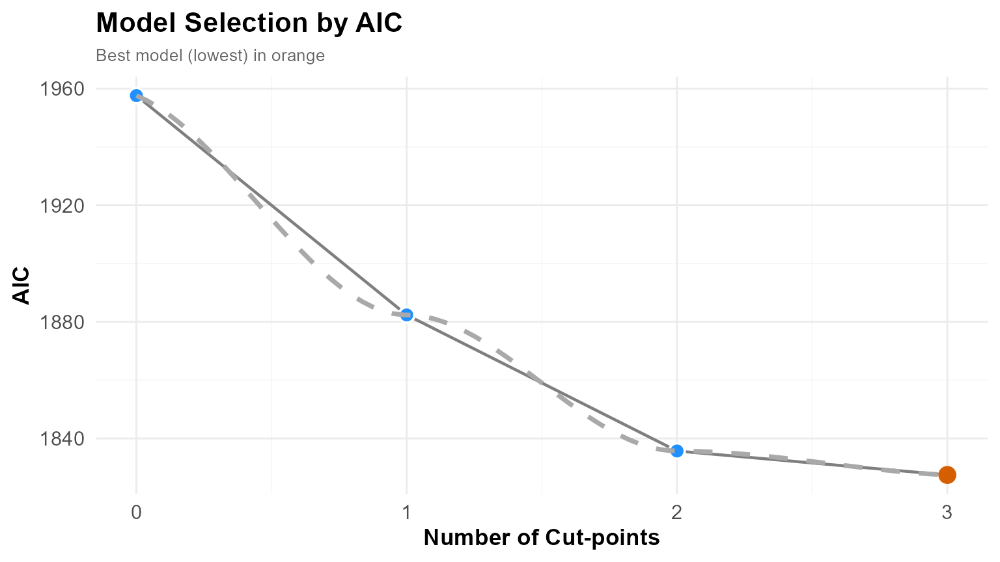
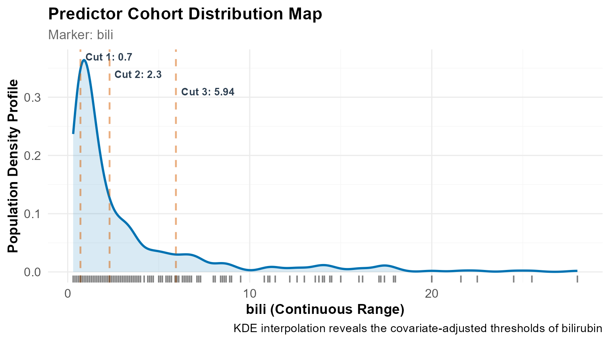
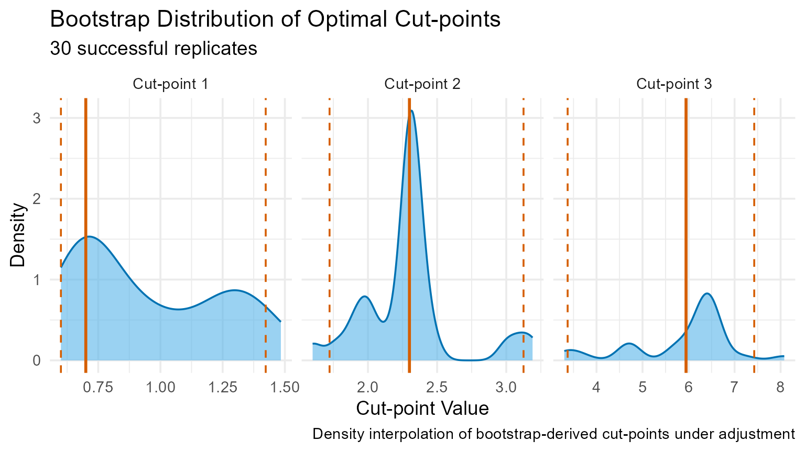
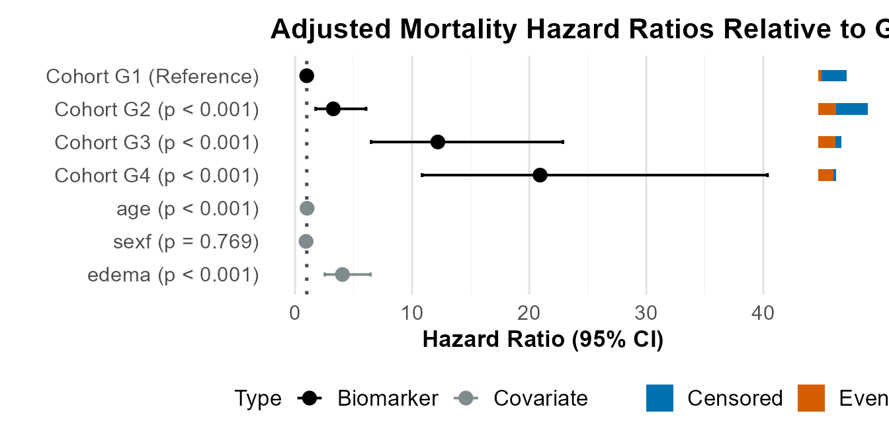
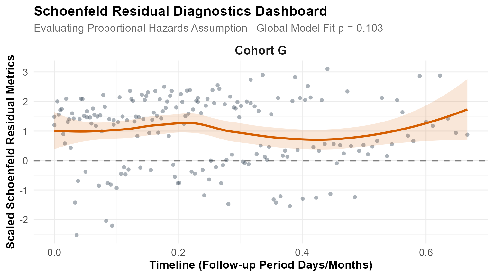
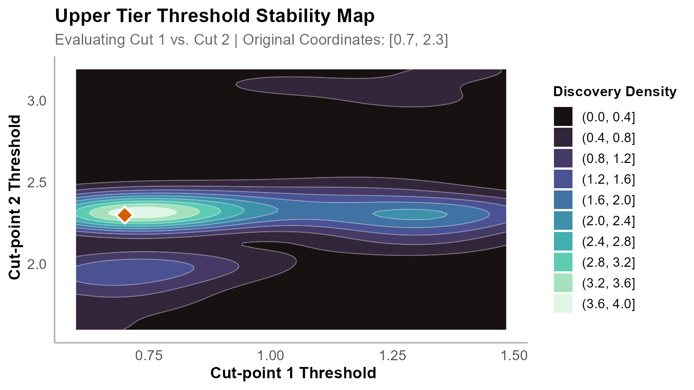
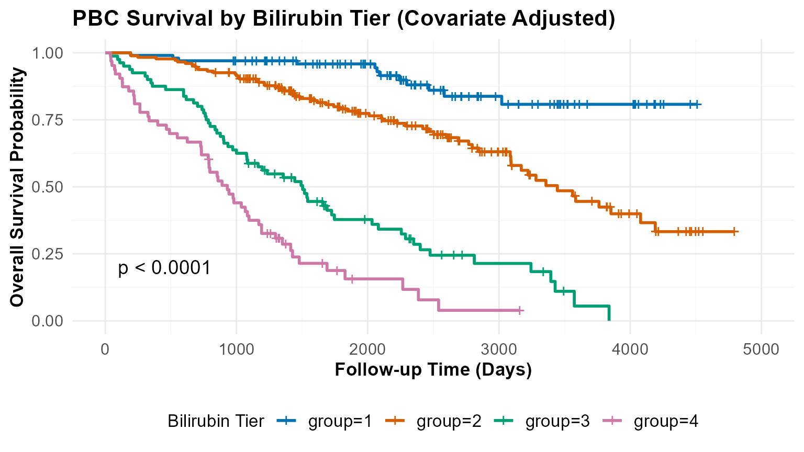

# Analysing Clinical Survival Data with OptSurvCutR

## Introduction

In clinical research, continuous biomarkers are often simplified into
binary groups using arbitrary thresholds like median splits. While
convenient, this approach obscures meaningful biological structure.

The **OptSurvCutR** package is built specifically to discover true,
mathematically optimal thresholds. Its core powerhouse is a **Genetic
Algorithm**—an evolutionary search engine capable of navigating massive,
multi-dimensional data to find optimal cut-points simultaneously, a task
where traditional methods would freeze.

Furthermore, the package features built-in statistical safety nets,
including a 2-Tier Schoenfeld diagnostic check and a comprehensive
4-Tier Validation Stability system. Crucially, the engine allows for
**covariate adjustment**, ensuring that the discovered biomarker
thresholds provide independent prognostic value even when controlling
for established clinical confounders like age or disease staging.

In this vignette, we apply this workflow to the classic **Mayo Clinic
Primary Biliary Cholangitis (PBC)** dataset to evaluate raw **serum
bilirubin**, controlling for age and edema.

------------------------------------------------------------------------

## 1. Setup & Data Preparation

To begin the analysis, we must first load our workspace environment with
the required data-wrangling libraries, graphics systems, and the
underlying survival and optimisation packages.

``` r

library(survival)
library(dplyr)
library(ggplot2)
library(patchwork)
library(knitr)
library(cli)
library(OptSurvCutR)
```

Next, we pull the historical baseline dataset into memory, strip out
clinical records containing missing entries across our features of
interest, and map all active events safely to isolate true endpoints.

``` r

data(pbc, package = "survival")

# Extract complete cases for our predictor, outcome, and clinical covariates
pbc_clean <- na.omit(pbc[, c("time", "status", "bili", "age", "sex", "edema")])

# Define the all-cause mortality survival event (1 or 2 = endpoint, 0 = censored)
pbc_clean$event <- ifelse(pbc_clean$status %in% c(1, 2), 1, 0)

head(pbc_clean)
#>   time status bili      age sex edema event
#> 1  400      2 14.5 58.76523   f   1.0     1
#> 2 4500      0  1.1 56.44627   f   0.0     0
#> 3 1012      2  1.4 70.07255   m   0.5     1
#> 4 1925      2  1.8 54.74059   f   0.5     1
#> 5 1504      1  3.4 38.10541   f   0.0     1
#> 6 2503      2  0.8 66.25873   f   0.0     1
```

> **💡 Key Insight: Dealing with Skewed Data & Confounders** Raw
> clinical lab values are often heavily right-skewed. Because
> `OptSurvCutR` evaluates survival using the Log-rank/Cox rank
> infrastructure—which looks at the *rank order* of patients rather than
> absolute numerical distance—the algorithm is mathematically immune to
> this skew.
>
> By passing `covariates = c("age","sex", "edema")`, the optimisation
> routine transitions from a univariate survival split to an adjusted
> Cox proportional hazards model framework, ensuring your cut-points
> reflect true baseline risk alterations independent of baseline age or
> physical edema presentation.

------------------------------------------------------------------------

## 2. The Three-Step Analysis Workflow

### Step 1: Determine the Optimal Number of Cuts

Before we ask *where* the cut-points are, we need to ask the math *how
many* cut-points actually exist in our data when adjusting for our
baseline covariates.

#### Choosing Your Information Criterion

The algorithm evaluates models using an Information Criterion, which
balances accuracy against complexity:

| Criterion | What it does | Best Use Case |
|:---|:---|:---|
| **AIC** | Light penalty for complexity. | Exploratory research; allows more cuts. |
| **AICc** | Corrects AIC for small sample sizes. | Small clinical datasets (N \< 200). |
| **BIC** | Heavy penalty for complexity. | Confirmatory research; prefers simpler, highly robust models. |

We deploy the multi-model search check to calculate fitness scores
across various grouping parameters, enforcing safety boundaries so that
cohorts don’t become unsustainably small.

``` r

num_res <- find_cutpoint_number(
  # ==========================================
  # 1. CORE DATA & COVARIATE INPUTS
  # ==========================================
  data = pbc_clean,           # The patient dataset
  predictor = "bili",         # The continuous biomarker
  outcome_time = "time",      # Survival time column
  outcome_event = "event",    # Survival event column
  covariates = c("age","sex","edema"), # Confounders to control for

  # ==========================================
  # 2. SEARCH ENGINE SETTINGS
  # ==========================================
  method = "genetic",         # The evolutionary search engine
  criterion = "AIC",          # Evaluates adjusted model fit
  max_cuts = 5,               # Test models ranging from 0 to 5 cuts
  nmin = 0.15,                # SAFETY LIMIT: Minimum 15% of patients per group
   
  # ==========================================
  # 3. ADVANCED GENETIC TUNING
  # ==========================================
  max.generations = NULL,     # LIFESPAN: How many evolutionary cycles to run
  pop.size = NULL,            # SEARCH PARTY: Number of random guesses per generation
  boundary.enforcement = 2,   # EDGE CONTROL: 2 = Soft boundary configuration
  seed = 123                  # REPRODUCIBILITY
)
#> ℹ nmin 0.15 is a proportion. Min. group size set to 62.
#> ℹ Finding optimal cut number: method = genetic
#> Running discrete genetic algorithm for 1 cut-point(s)...
#> Running discrete genetic algorithm for 2 cut-point(s)...
#> Running discrete genetic algorithm for 3 cut-point(s)...
#> Running discrete genetic algorithm for 4 cut-point(s)...
#> ! Model with 4 cut-point(s) collapsed: Subgroups violated the minimum 'nmin' constraint of 62 subjects.
#> 
#> Running discrete genetic algorithm for 5 cut-point(s)...
#> ! Model with 5 cut-point(s) collapsed: Subgroups violated the minimum 'nmin' constraint of 62 subjects.
```

Here, we use [`summary()`](https://rdrr.io/r/base/summary.html) for
detailed information.

``` r

summary(num_res)
#> 
#> ── Optimal Cut-point Number Analysis (Genetic) ─────────────────────────────────
#> ✔ Best Model: 3 Cut-points (Criterion: AIC)
#> ℹ Optimal Thresholds: "0.9, 1.4, 3.5"
#> 
#> ── 1. Model Comparison ──
#> 
#>  Marker num_cuts     AIC Delta_AIC AIC_Weight    Evidence
#>                0 1957.60    130.11         0%     Minimal
#>                1 1882.37     54.88         0%     Minimal
#>                2 1835.71      8.22       1.6%     Minimal
#>       >        3 1827.49      0.00      98.4% Substantial
#> ── 2. Clinical Risk Cohorts ──
#>  Group   N Events          Median_CI
#>     G1 142     23       NA (NA - NA)
#>     G2  76     26   3561 (3086 - NA)
#>     G3 102     59 2286 (1725 - 3222)
#>     G4  98     78   980 (859 - 1235)
#> ── 3. Cox Proportional-Hazards ──
#>  Group     HR Lower  Upper P_Value Signif
#>     G2  2.169 1.236  3.809   0.007     **
#>     G3  4.934 3.020  8.062   0.000    ***
#>     G4 12.178 7.503 19.766   0.000    ***
#>    age  1.025 1.011  1.039   0.001    ***
#>   sexf  0.940 0.612  1.444   0.778       
#>  edema  4.965 3.099  7.955   0.000    ***
#> ℹ Overall Model: Concordance = 0.802 | Log-rank p = 0
#> 
#> ── 4. Time-Dependent Diagnostics (Schoenfeld) ──
#> 
#> ✔ Passed: The proportional hazards assumption holds across the follow-up period (Global p = 0.29).
#> 
#> ── 5. Analysis Parameters ──
#> 
#> • Search Method: Genetic
#> • Predictor: bili
#> • Criterion: AIC
#> • Maximum Cuts Evaluated: 5
#> • Minimum Group Size (nmin): 62
#> • Covariates: age, sex, edema
```

To easily track the inflection points where adding more thresholds
yields diminishing mathematical returns, we plot the complete
multi-model fitness curve.

``` r

plot(num_res) +
  geom_smooth(method = "loess", 
              se = FALSE, 
              colour = "darkgrey", 
              linetype = "dashed", 
              alpha = 0.5)
#> `geom_smooth()` using formula = 'y ~ x'
#> Warning in simpleLoess(y, x, w, span, degree = degree, parametric = parametric,
#> : span too small.  fewer data values than degrees of freedom.
#> Warning in simpleLoess(y, x, w, span, degree = degree, parametric = parametric,
#> : pseudoinverse used at -0.015
#> Warning in simpleLoess(y, x, w, span, degree = degree, parametric = parametric,
#> : neighborhood radius 2.015
#> Warning in simpleLoess(y, x, w, span, degree = degree, parametric = parametric,
#> : reciprocal condition number 0
#> Warning in simpleLoess(y, x, w, span, degree = degree, parametric = parametric,
#> : There are other near singularities as well. 4.0602
```



**Interpretation:** The model minimising the information landscape sits
clearly at **2 cut-points** (which divides the patient cohort into 3
distinct risk groups). This confirms that even after stripping away the
confounding baseline effects of age and sex, a multi-tier group model is
statistically superior to a traditional median binary split.

### Step 2: Pinpointing the Exact Cut-point Values

This step is the heart of `OptSurvCutR`. We ask the search engine to
physically locate the optimal dividing lines while holding our adjusted
covariates constant.

We initiate the core optimisation search loop, directing the engine to
settle on an integer space topology that maximises group risk divergence
under active covariate adjustment.

``` r

cut_res <- find_cutpoint(
  # ==========================================
  # 1. CORE DATA & COVARIATE INPUTS
  # ==========================================
  data = pbc_clean,
  predictor = "bili",
  outcome_time = "time",
  outcome_event = "event",
  covariates = c("age","sex","edema"), # Adjusted during location discovery

  # ==========================================
  # 2. SEARCH ENGINE SETTINGS
  # ==========================================
  method = "genetic", 
  criterion = "logrank", 
  num_cuts = 3,       # Setting 3 cuts for clinical tier separation
  nmin = 0.15,         # SAFETY LIMIT: Minimum patients per risk cohort
  n_perm = 20,        # Streamlined permutation cycle

  # ==========================================
  # 3. ADVANCED GENETIC TUNING
  # ==========================================
  max.generations = NULL,   
  pop.size = NULL,          
  boundary.enforcement = 2, 
  seed = 123,               
  n_cores = 1               
)
#> ℹ nmin 0.15 is a proportion. Min. group size set to 62.
#> ℹ Starting regularized genetic search for 3 cut(s)...
#> ℹ Running 20 permutations to calculate adjusted p-value...
```

Now, we call the optimisation summary report to extract hazard
thresholds, coefficients, and preliminary model diagnostics.

``` r

summary(cut_res)
#> 
#> ── Optimal Cut-point Analysis for Survival Data (Genetic) ──────────────────────
#> ✔ Optimal Threshold(s): "0.7, 2.3, 5.945"
#> ℹ Permutation-Adjusted P-value (20 runs): 0.0476
#> 
#> ── 1. Stratified Risk Cohorts ──
#> 
#>  Group   N Events      Median_Time OS Rate at T=4795
#>     G1 100     12 NR (Not Reached) 80.8% (70.8-92.1)
#>     G2 175     62             3445 33.3% (22.4-49.3)
#>     G3  80     60             1504        0% (NA-NA)
#>     G4  63     52              930   3.9% (0.6-24.4)
#> ── 2. Cox Proportional-Hazards ──
#>  Group     HR  Lower  Upper P_Value Signif
#>     G2  3.267  1.759  6.066   0.000    ***
#>     G3 12.197  6.502 22.881   0.000    ***
#>     G4 20.929 10.853 40.359   0.000    ***
#>    age  1.027  1.012  1.041   0.000    ***
#>   sexf  0.938  0.613  1.435   0.769       
#>  edema  4.048  2.542  6.446   0.000    ***
#> ℹ Overall Model: Concordance = 0.811 | Log-rank p = 0
#> 
#> ── 3. Time-Dependent Diagnostics (Schoenfeld) ──
#> 
#> ✔ Passed: The proportional hazards assumption holds across the follow-up period (Global p = 0.103).
#> 
#> ── 4. Analysis Parameters ──
#> 
#> • Search Method: Genetic
#> • Predictor: bili
#> • Number of cuts: 3
#> • Minimum group size (nmin): 62
#> • Covariates: age, sex, edema
#> • Permutations: 20
```

#### 🔍 Automated Diagnostic Check: The 2-Tier Schoenfeld Diagnostic

When evaluating [`summary()`](https://rdrr.io/r/base/summary.html), the
package automatically processes a Schoenfeld residuals validation check
against your adjusted model matrix, verifying if the Proportional
Hazards assumption holds:

| Diagnostic Status | What it Means (Schoenfeld Test) | Clinical Implication |
|:---|:---|:---|
| **Tier 1 (Proportional)** | The proportional hazards assumption holds ($`p > 0.05`$). | Your cut-points remain equally deadly/protective on Day 1 as they do on Day 1,000. Reporting a standard adjusted Hazard Ratio is valid. |
| **Tier 2 (Time-Varying)** | The hazard ratio changes significantly over time ($`p < 0.05`$). | Your cut-point is still biologically valid, but its predictive power shifts over time. You may need to report time-dependent Hazard Ratios. |

To visualise where these calculated cut-points slice across the patient
density profile, we map our continuous marker distribution.

``` r

plot(cut_res, type = "distribution") +
  geom_rug(alpha = 0.5) +
  labs(caption = "KDE interpolation reveals the covariate-adjusted thresholds of bilirubin")
```



------------------------------------------------------------------------

### Step 3: Validate the Threshold Stability

We use Bootstrap Resampling to ensure our covariate-adjusted thresholds
are real and completely independent of sample noise.

We run repetitive bootstrap sampling loops, forcing the optimisation
engine to re-verify the marker thresholds across randomised slices of
our cohort.

``` r

val_res <- validate_cutpoint(
  # ==========================================
  # 1. VALIDATION INPUTS
  # ==========================================
  cutpoint_result = cut_res, 
  num_replicates = 30,       # 500+ is the standard for final publication
  n_cores = 1, 

  # ==========================================
  # 2. ADVANCED SETTINGS (Must match Step 2)
  # ==========================================
  max.generations = NULL, 
  pop.size = NULL, 
  boundary.enforcement = 2, 
  seed = 123 
)
#> ℹ Using random seed 123 for reproducibility.
#> ℹ Bootstrap `nmin` not set. Using 55 (90% of original) to improve stability.
#> ℹ Validating 3 cut(s) from 'genetic' search using 'logrank' over regularized coordinate lattice.
#> ℹ Running 30 replicates sequentially (n_cores = 1).
#> Bootstrapping ■■■                                7% | ETA: 14sBootstrapping ■■■■                              10% | ETA: 14sBootstrapping ■■■■■                             13% | ETA: 16sBootstrapping ■■■■■■                            17% | ETA: 17sBootstrapping ■■■■■■■                           20% | ETA: 17sBootstrapping ■■■■■■■■                          23% | ETA: 16sBootstrapping ■■■■■■■■■                         27% | ETA: 16sBootstrapping ■■■■■■■■■■                        30% | ETA: 16sBootstrapping ■■■■■■■■■■■                       33% | ETA: 16sBootstrapping ■■■■■■■■■■■■                      37% | ETA: 15sBootstrapping ■■■■■■■■■■■■■                     40% | ETA: 15sBootstrapping ■■■■■■■■■■■■■■                    43% | ETA: 14sBootstrapping ■■■■■■■■■■■■■■■                   47% | ETA: 14sBootstrapping ■■■■■■■■■■■■■■■■                  50% | ETA: 13sBootstrapping ■■■■■■■■■■■■■■■■■                 53% | ETA: 11sBootstrapping ■■■■■■■■■■■■■■■■■■                57% | ETA: 11sBootstrapping ■■■■■■■■■■■■■■■■■■■               60% | ETA: 10sBootstrapping ■■■■■■■■■■■■■■■■■■■■              63% | ETA:  9sBootstrapping ■■■■■■■■■■■■■■■■■■■■■             67% | ETA:  8sBootstrapping ■■■■■■■■■■■■■■■■■■■■■■            70% | ETA:  7sBootstrapping ■■■■■■■■■■■■■■■■■■■■■■■           73% | ETA:  7sBootstrapping ■■■■■■■■■■■■■■■■■■■■■■■■          77% | ETA:  6sBootstrapping ■■■■■■■■■■■■■■■■■■■■■■■■■         80% | ETA:  5sBootstrapping ■■■■■■■■■■■■■■■■■■■■■■■■■■        83% | ETA:  4sBootstrapping ■■■■■■■■■■■■■■■■■■■■■■■■■■■       87% | ETA:  3sBootstrapping ■■■■■■■■■■■■■■■■■■■■■■■■■■■■      90% | ETA:  2sBootstrapping ■■■■■■■■■■■■■■■■■■■■■■■■■■■■■     93% | ETA:  2sBootstrapping ■■■■■■■■■■■■■■■■■■■■■■■■■■■■■■    97% | ETA:  1s                                                               ✔ 30 replicates completed.
```

We look at the aggregated validation metrics to review the underlying
variance metrics across our calculated thresholds.

``` r

summary(val_res)
#> Cut-point Stability Analysis (Bootstrap)
#> ----------------------------------------
#> Original Optimal Cut-point(s): 0.7, 2.3, 5.945 
#> 
#> Bootstrap Distribution Summary
#> -----------------------------
#>       Cut  Mean    SD Median    Q1    Q3
#> 25%  Cut1 0.947 0.290  0.830 0.700 1.275
#> 25%1 Cut2 2.290 0.341  2.300 2.142 2.339
#> 25%2 Cut3 5.892 1.094  6.353 5.700 6.447
#> 
#> 95% Confidence Intervals
#> ------------------------
#>       Lower Upper
#> Cut 1 0.600 1.423
#> Cut 2 1.723 3.125
#> Cut 3 3.372 7.426
#> 
#> Validation Parameters
#> ---------------------
#> Replicates Requested: 30 
#> Successful Replicates: 30 / 30 ( 100 %)
#> Failed Replicates: 0 
#> Cores Used: 1 
#> Seed: 123 
#> Minimum Group Size (nmin): 55 
#> Method: genetic 
#> Criterion: logrank 
#> Covariates: age, sex, edema 
#> 
#> 
#> Stability Assessment:
#> ---------------------
#> Maximum CI Width (Relative to 10th-90th Percentile Range): 71.1%
#> ✔ Model Status: DISTINCT (Tier 2) - SEPARATION OVERRIDE
#> The relative mathematical variance is high (71.1%), but 95% Confidence
#> Intervals do not overlap.
```

#### 🔍 Automated Performance Grading: The 4-Tier Stability Assessment

Following bootstrap calculations, `OptSurvCutR` evaluates both your
**Precision** (Confidence Interval width relative to overall data range)
and **Validity** (absence of interval overlap), grading model health
into four distinct tiers:

1.  **Tier 1 (OPTIMAL):** Narrow intervals (CI Width \< 30%) paired with
    complete cohort separation.
2.  **Tier 2 (DISTINCT):** Zero overlap between confidence zones
    regardless of width. Thresholds may float slightly, but risk
    boundaries remain clear.
3.  **Tier 3 (CAUTION):** Moderate parameter variance (CI Width 30%–60%)
    accompanied by overlapping intervals.
4.  **Tier 4 (UNSTABLE):** High variance (CI Width \> 60%) with
    overlapping intervals, signaling severe data over-fitting.

For precise documentation, we compile our numerical confidence intervals
directly into a clean markdown summary table.

``` r

knitr::kable(val_res$confidence_intervals, digits = 3, caption = "Covariate-Adjusted Stability Intervals for Bilirubin Risk Thresholds")
```

|       | Lower | Upper |
|:------|------:|------:|
| Cut 1 | 0.600 | 1.423 |
| Cut 2 | 1.723 | 3.125 |
| Cut 3 | 3.372 | 7.426 |

Covariate-Adjusted Stability Intervals for Bilirubin Risk Thresholds
{.table}

To see if our thresholds remain tightly anchored or scatter across the
iterations, we inspect the bootstrap density landscape.

``` r

plot(val_res) +
  labs(caption = "Density interpolation of bootstrap-derived cut-points under adjustment")
```



------------------------------------------------------------------------

## 3. Advanced Visualisation & Reporting

### 3.1 Group Composition Table

We can check the physical distributions and average baseline parameters
across our newly established medical risk tiers.

``` r

final_dataset <- plot(cut_res, return_data = TRUE)

composition_table <- final_dataset %>%
  group_by(group) %>%
  summarise(
    Bilirubin_Range = paste0(
      round(min(factor), 3), " – ", round(max(factor), 3)
    ),
    N = n(),
    Deaths = sum(event),
    Mean_Age = round(mean(age), 1),
    Edema_Rate = round(mean(edema), 2)
  )

knitr::kable(composition_table, caption = "Composition and Covariate Profiles of Discovered Bilirubin Risk Groups")
```

| group | Bilirubin_Range |   N | Deaths | Mean_Age | Edema_Rate |
|:------|:----------------|----:|-------:|---------:|-----------:|
| 1     | 0.3 – 0.7       | 100 |     12 |     51.0 |       0.04 |
| 2     | 0.8 – 2.3       | 175 |     62 |     51.0 |       0.07 |
| 3     | 2.4 – 5.9       |  80 |     60 |     49.4 |       0.09 |
| 4     | 6 – 28          |  63 |     52 |     51.4 |       0.28 |

Composition and Covariate Profiles of Discovered Bilirubin Risk Groups
{.table}

### 3.2 Adjusted Hazard Ratio Forest Plot (`type = "forest"`)

We can easily plot a custom forest chart to display our adjusted hazard
models relative to the low-risk baseline tier.

``` r

plot(cut_res,
  type = "forest",
  main = "Adjusted Mortality Hazard Ratios Relative to Group 1"
)
```



### 3.3 Time-Dependent Diagnostics (`type = "diagnostic"`)

We track whether our optimisation groups safely adhere to proportional
variance targets across the complete time scope.

``` r

plot(cut_res, type = "diagnostic")
#> `geom_smooth()` using formula = 'y ~ x'
```



### 3.4 2D Cut-point Stability Surface (plot_validation())

Rather than relying on blocky grids,
[`plot_validation()`](https://paytonyau.github.io/OptSurvCutR/reference/plot_validation.md)
allows us to project high-dimensional bootstrap convergence horizons
onto a smooth 2D continuous contour map, highlighting exactly where our
optimal threshold combinations cluster.

``` r

plot_validation(val_res,
  focus_cuts = c(1, 2),
  main = "Upper Tier Threshold Stability Map"
)
```



### 3.5 Adjusted Kaplan-Meier Survival Curves (`type = "outcome"`)

We evaluate the clear divergence in survival over time by mapping the
adjusted step functions for our groups.

``` r

plot(cut_res,
  type = "outcome",
  title = "PBC Survival by Bilirubin Tier (Covariate Adjusted)",
  xlab = "Follow-up Time (Days)",
  ylab = "Overall Survival Probability",
  legend.title = "Bilirubin Tier"
)
```



### 3.6 Exporting Your Stratified Data

By passing `return_data = TRUE`, you can seamlessly extract your
original clinical dataset paired with the newly calculated `group` and
original covariate column assignments.

``` r

stratified_patients <- plot(cut_res, return_data = TRUE)
head(stratified_patients[, c("time", "event", "factor", "age", "sex","edema", "group")])
#>   time event factor      age sex edema group
#> 1  400     1   14.5 58.76523   f   1.0     4
#> 2 4500     0    1.1 56.44627   f   0.0     2
#> 3 1012     1    1.4 70.07255   m   0.5     2
#> 4 1925     1    1.8 54.74059   f   0.5     2
#> 5 1504     1    3.4 38.10541   f   0.0     3
#> 6 2503     1    0.8 66.25873   f   0.0     2
```

------------------------------------------------------------------------

## 4. Conclusion

This vignette demonstrates how **OptSurvCutR** controls for clinical
confounding factors during optimal threshold selection. By providing a
streamlined pipeline for covariate-adjusted optimisation, clinical
scientists can establish reliable diagnostic thresholds that retain
absolute structural validity across independent validation cohorts.

------------------------------------------------------------------------

## 5. Session Information

Finally, we print our system specifications, environmental packages, and
runtime tracking indices to ensure perfect documentation
reproducibility.

``` r

sessionInfo()
#> R version 4.6.0 (2026-04-24 ucrt)
#> Platform: x86_64-w64-mingw32/x64
#> Running under: Windows 11 x64 (build 26200)
#> 
#> Matrix products: default
#>   LAPACK version 3.12.1
#> 
#> locale:
#> [1] LC_COLLATE=English_United Kingdom.utf8 
#> [2] LC_CTYPE=English_United Kingdom.utf8   
#> [3] LC_MONETARY=English_United Kingdom.utf8
#> [4] LC_NUMERIC=C                           
#> [5] LC_TIME=English_United Kingdom.utf8    
#> 
#> time zone: Europe/London
#> tzcode source: internal
#> 
#> attached base packages:
#> [1] stats     graphics  grDevices utils     datasets  methods   base     
#> 
#> other attached packages:
#> [1] OptSurvCutR_0.9.9 cli_3.6.6         knitr_1.51        patchwork_1.3.2  
#> [5] ggplot2_4.0.3     dplyr_1.2.1       survival_3.8-6   
#> 
#> loaded via a namespace (and not attached):
#>  [1] gtable_0.3.6       xfun_0.58          bslib_0.11.0       htmlwidgets_1.6.4 
#>  [5] rstatix_0.7.3      lattice_0.22-9     vctrs_0.7.3        tools_4.6.0       
#>  [9] generics_0.1.4     parallel_4.6.0     tibble_3.3.1       pkgconfig_2.0.3   
#> [13] Matrix_1.7-5       RColorBrewer_1.1-3 S7_0.2.2           desc_1.4.3        
#> [17] lifecycle_1.0.5    compiler_4.6.0     farver_2.1.2       textshaping_1.0.5 
#> [21] codetools_0.2-20   carData_3.0-6      htmltools_0.5.9    sass_0.4.10       
#> [25] yaml_2.3.12        Formula_1.2-5      pillar_1.11.1      pkgdown_2.2.0.9000
#> [29] car_3.1-5          ggpubr_0.6.3       jquerylib_0.1.4    tidyr_1.3.2       
#> [33] MASS_7.3-65        cachem_1.1.0       survminer_0.5.2    iterators_1.0.14  
#> [37] rgenoud_5.9-0.11   abind_1.4-8        foreach_1.5.2      nlme_3.1-169      
#> [41] tidyselect_1.2.1   digest_0.6.39      purrr_1.2.2        labeling_0.4.3    
#> [45] splines_4.6.0      fastmap_1.2.0      grid_4.6.0         magrittr_2.0.5    
#> [49] broom_1.0.13       withr_3.0.2        scales_1.4.0       backports_1.5.1   
#> [53] rmarkdown_2.31     otel_0.2.0         gridExtra_2.3      ggsignif_0.6.4    
#> [57] ragg_1.5.2         evaluate_1.0.5     doParallel_1.0.17  viridisLite_0.4.3 
#> [61] mgcv_1.9-4         rlang_1.2.0        Rcpp_1.1.1-1.1     isoband_0.3.0     
#> [65] glue_1.8.1         rstudioapi_0.18.0  jsonlite_2.0.0     R6_2.6.1          
#> [69] systemfonts_1.3.2  fs_2.1.0
```

\`\`\`
