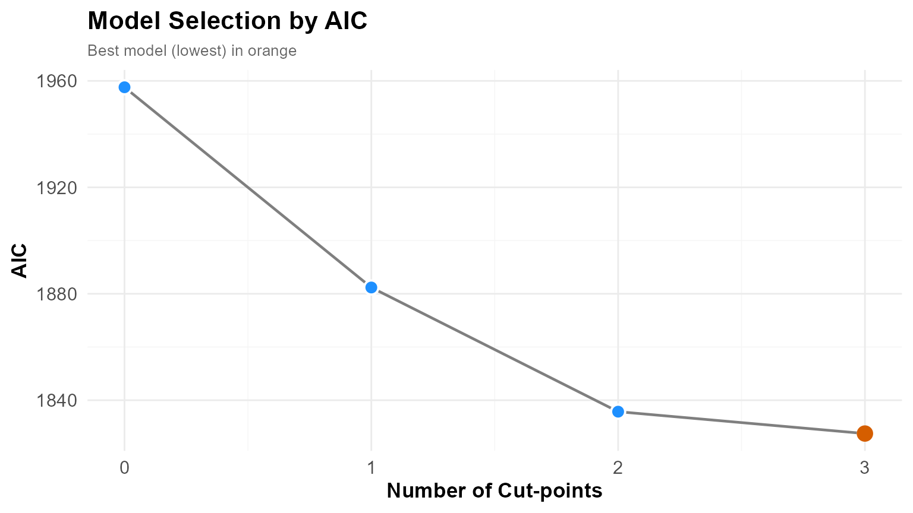
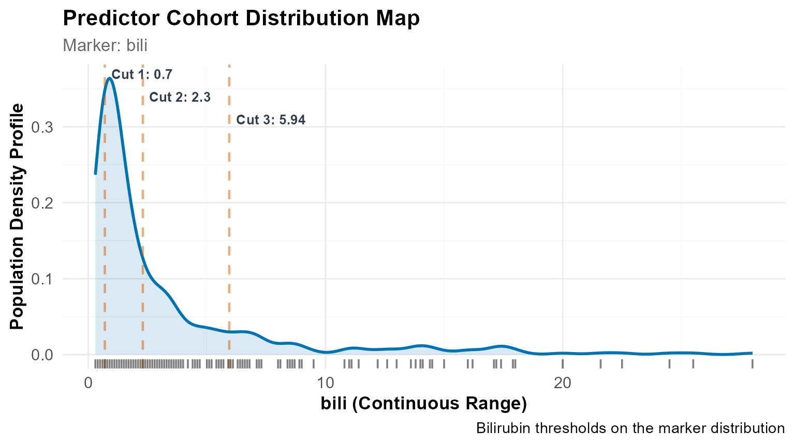
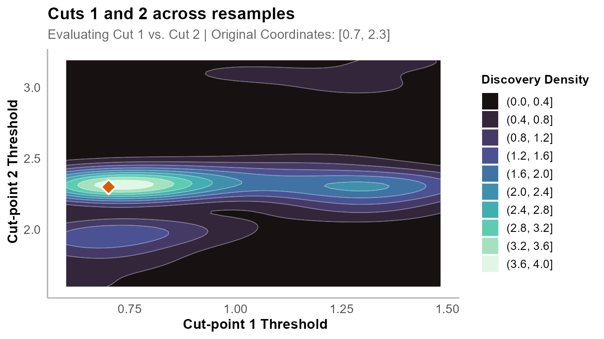
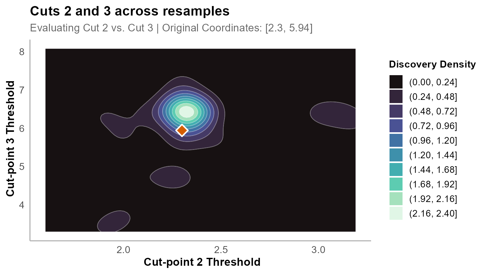

# Analysing Clinical Survival Data with OptSurvCutR

## Introduction

Continuous biomarkers are routinely split into risk groups using a
median or a threshold borrowed from another study. Both are arbitrary,
and a single split cannot represent a relationship where risk rises in
stages.

`OptSurvCutR` selects thresholds by optimising a survival criterion, and
then assesses how far those thresholds move under resampling.

| Function | Question | Output |
|:---|:---|:---|
| [`find_cutpoint_number()`](https://paytonyau.github.io/OptSurvCutR/reference/find_cutpoint_number.md) | How many groups? | A number, *k* |
| [`find_cutpoint()`](https://paytonyau.github.io/OptSurvCutR/reference/find_cutpoint.md) | Where are the boundaries? | *k* thresholds |
| [`validate_cutpoint()`](https://paytonyau.github.io/OptSurvCutR/reference/validate_cutpoint.md) | How much do they move? | Intervals + stability tier |

### How this differs from a single optimal cut-point

Established tools solve part of this problem well. `maxstat` computes a
maximally selected rank statistic with a corrected *p*-value, which
addresses the inflation that comes from testing many candidate
thresholds;
[`survminer::surv_cutpoint()`](https://rdrr.io/pkg/survminer/man/surv_cutpoint.html)
wraps it in a convenient interface. If a single unadjusted threshold is
what the question needs, they are a sound choice.

`OptSurvCutR` covers three things they do not:

|  | `maxstat` / `survminer` | `OptSurvCutR` |
|:---|:---|:---|
| Number of cut-points | One | Chosen from the data, one or more |
| Covariate adjustment | No | Yes, inside the search |
| Threshold stability | Not assessed | Bootstrap intervals and a tier |

The third is the one that changes conclusions. A corrected *p*-value
tells you a threshold is unlikely to have arisen by chance; it says
nothing about whether the same threshold would be found again in a
comparable sample. Those are different questions, and in this vignette
they give different answers: the four-group model is significant by any
test, yet its boundaries are not reproducible.

### The data

The Mayo Clinic trial of D-penicillamine in **primary biliary
cholangitis** (Dickson et al., 1989) followed 418 patients with this
chronic autoimmune liver disease, in which progressive destruction of
the bile ducts leads to cholestasis, cirrhosis and eventually liver
failure.

**Serum bilirubin** is the classic marker of that progression: as bile
drainage fails, bilirubin accumulates. It is the strongest single
component of the Mayo risk score, and clinicians have long used
thresholds of it to time referral for transplantation. Values above
roughly 1.2 mg/dL are considered abnormal.

Here we ask what threshold the data themselves support, adjusting for
age, sex and the presence of edema.

------------------------------------------------------------------------

## 1. Data preparation

``` r

library(survival)
library(dplyr)
library(ggplot2)
library(knitr)
library(OptSurvCutR)
```

``` r
data(pbc, package = "survival")

pbc_clean <- na.omit(pbc[, c("time", "status", "bili", "age", "sex", "edema")])

# Endpoint: transplant-free survival
# status: 0 = censored, 1 = transplant, 2 = death
pbc_clean$event <- as.integer(pbc_clean$status %in% c(1, 2))

nrow(pbc_clean)
+ [1] 418
```

All six variables are complete across `pbc`, so the analysis retains all
418 patients. The figure of 312 often quoted for this dataset refers to
records with complete `trt` and laboratory values, which this model does
not use.

Transplant is treated as an event rather than a censoring. Transplants
are allocated preferentially to the sickest patients, so censoring them
would remove the highest-risk patients from the high-bilirubin groups
just as they were about to fail.

Adjusting for `age`, `sex` and `edema` means thresholds are selected
inside a Cox model containing those variables, so a threshold cannot
appear useful merely by tracking one of them.

------------------------------------------------------------------------

## 2. How many cut-points?

[`find_cutpoint_number()`](https://paytonyau.github.io/OptSurvCutR/reference/find_cutpoint_number.md)
compares models of increasing complexity using an information criterion.
AIC penalises complexity lightly and suits exploratory work; BIC is
stricter and is the better choice when a threshold is intended for
clinical use. AICc corrects AIC for small samples ($`N < 200`$).

``` r
num_res <- find_cutpoint_number(
  data = pbc_clean, predictor = "bili",
  outcome_time = "time", outcome_event = "event",
  covariates = c("age", "sex", "edema"),
  method = "genetic", criterion = "AIC",
  max_cuts = 5,
  nmin = 0.15,          # each group holds at least 15% of patients
  max.generations = NULL, pop.size = NULL,
  boundary.enforcement = 2, seed = 123
)
+ ℹ nmin 0.15 is a proportion. Min. group size set to 62.
+ ℹ Finding optimal cut number: method = genetic
+ Running discrete genetic algorithm for 1 cut-point(s)...
+ Running discrete genetic algorithm for 2 cut-point(s)...
+ Running discrete genetic algorithm for 3 cut-point(s)...
+ Running discrete genetic algorithm for 4 cut-point(s)...
+ ! Model with 4 cut-point(s) collapsed: Subgroups violated the minimum 'nmin' constraint of 62 subjects.
+ 
+ Running discrete genetic algorithm for 5 cut-point(s)...
+ ! Model with 5 cut-point(s) collapsed: Subgroups violated the minimum 'nmin' constraint of 62 subjects.

summary(num_res)
+ 
+ ── Optimal Cut-point Number Analysis (Genetic) ─────────────────────────────────
+ ✔ Best Model: 3 Cut-points (Criterion: AIC)
+ ℹ Optimal Thresholds: "0.9, 1.4, 3.5"
+ 
+ ── 1. Model Comparison ──
+  Marker num_cuts     AIC Delta_AIC AIC_Weight    Evidence
+                0 1957.60    130.11         0%     Minimal
+                1 1882.37     54.88         0%     Minimal
+                2 1835.71      8.22       1.6%     Minimal
+       >        3 1827.49      0.00      98.4% Substantial
+ ── 2. Clinical Risk Cohorts ──
+  Group   N Events          Median_CI
+     G1 142     23       NA (NA - NA)
+     G2  76     26   3561 (3086 - NA)
+     G3 102     59 2286 (1725 - 3222)
+     G4  98     78   980 (859 - 1235)
+ ── 3. Cox Proportional-Hazards ──
+    Group     HR Lower  Upper P_Value Signif
+  groupG2  2.169 1.236  3.809   0.007     **
+  groupG3  4.934 3.020  8.062   0.000    ***
+  groupG4 12.178 7.503 19.766   0.000    ***
+      age  1.025 1.011  1.039   0.001    ***
+     sexf  0.940 0.612  1.444   0.778       
+    edema  4.965 3.099  7.955   0.000    ***
+ ℹ Overall Model: Concordance = 0.802 | Log-rank p = 0
+ 
+ ── 4. Time-Dependent Diagnostics (Schoenfeld) ──
+ 
+ ✔ Passed: The proportional hazards assumption holds across the follow-up period (Global p = 0.29).
+ 
+ ── 5. Analysis Parameters ──
+ 
+ * Search Method: Genetic
+ * Predictor: bili
+ * Criterion: AIC
+ * Maximum Cuts: 5
+ * Minimum Group Size (nmin): 62
+ * Covariates: age, sex, edema
```

``` r

plot(num_res)
```



AIC is minimised at **three cut-points**, carrying 98.4% of the AIC
weight against 1.6% for the two-cut model.

The four- and five-cut models return no valid solution: with
`nmin = 0.15` each group needs 62 patients, and the genetic search found
no partition that satisfied this. A search returning nothing does not
prove that nothing exists — raising `max.generations` and `pop.size`, or
lowering `nmin`, may find one.

------------------------------------------------------------------------

## 3. Where are the boundaries?

``` r
cut_res <- find_cutpoint(
  data = pbc_clean, predictor = "bili",
  outcome_time = "time", outcome_event = "event",
  covariates = c("age", "sex", "edema"),
  method = "genetic", criterion = "logrank",
  num_cuts = num_res$optimal_num_cuts,   # carried from step 1
  nmin = 0.15,
  n_perm = 20,          # low for build speed; use >= 1000 when reporting
  max.generations = NULL, pop.size = NULL,
  boundary.enforcement = 2, seed = 123, n_cores = 1
)
+ ℹ nmin 0.15 is a proportion. Min. group size set to 62.
+ ℹ Starting regularised genetic search for 3 cut(s)...
+ ℹ Running 20 permutations to calculate adjusted p-value...

summary(cut_res)
+ 
+ ── Optimal Cut-point Analysis for Survival Data (Genetic) ──────────────────────
+ ✔ Optimal Threshold(s): "0.7, 2.3, 5.945"
+ ℹ Permutation-Adjusted P-value (20 runs): 0.0476
+ 
+ ── 1. Stratified Risk Cohorts ──
+ 
+  Group   N Events      Median_Time OS Rate at T=4795
+     G1 100     12 NR (Not Reached) 80.8% (70.8-92.1)
+     G2 175     62             3445 33.3% (22.4-49.3)
+     G3  80     60             1504        0% (NA-NA)
+     G4  63     52              930   3.9% (0.6-24.4)
+ ── 2. Cox Proportional-Hazards ──
+  Group     HR  Lower  Upper P_Value Signif
+     G2  3.267  1.759  6.066   0.000    ***
+     G3 12.197  6.502 22.881   0.000    ***
+     G4 20.929 10.853 40.359   0.000    ***
+    age  1.027  1.012  1.041   0.000    ***
+   sexf  0.938  0.613  1.435   0.769       
+  edema  4.048  2.542  6.446   0.000    ***
+ ℹ Overall Model: Concordance = 0.811 | Log-rank p = 0
+ 
+ ── 3. Time-Dependent Diagnostics (Schoenfeld) ──
+ 
+ ✔ Passed: The proportional hazards assumption holds across the follow-up period (Global p = 0.103).
+ 
+ ── 4. Analysis Parameters ──
+ 
+ • Search Method: Genetic
+ • Predictor: bili
+ • Number of cuts: 3
+ • Minimum group size (nmin): 62
+ • Covariates: age, sex, edema
+ • Permutations: 20
```

`num_cuts` is taken from the Step 1 object rather than specified
directly. Selecting the number of groups after inspecting the survival
curves would reintroduce the selection problem that Step 1 is intended
to control.

The thresholds are **0.7, 2.3 and 5.945 mg/dL**, giving groups of 100,
175, 80 and 63 patients. Hazard ratios rise across them (3.27, 12.20,
20.93 relative to the lowest group) and median transplant-free survival
falls from not reached to 3445, 1504 and 930 days. Concordance is 0.811.

The reported permutation *p* of 0.0476 is exactly 1/(20+1), the smallest
value `n_perm = 20` can return. It means no permutation exceeded the
observed statistic, not that *p* equals 0.0476.

The Schoenfeld test gives *p* = 0.103, so there is no evidence against
proportional hazards and the hazard ratios can be read as approximately
constant over follow-up.

``` r

plot(cut_res, type = "distribution") +
  geom_rug(alpha = 0.5) +
  labs(caption = "Bilirubin thresholds on the marker distribution")
```



------------------------------------------------------------------------

## 4. Are the boundaries stable?

[`validate_cutpoint()`](https://paytonyau.github.io/OptSurvCutR/reference/validate_cutpoint.md)
re-runs the search on resampled cohorts and records where each boundary
lands.

``` r
val_res <- validate_cutpoint(
  cutpoint_result = cut_res,
  num_replicates = 30,      # reduced for build speed; use >= 500 when reporting
  n_cores = 1,      # single core: vignette builds cannot use parallel workers
  max.generations = NULL, pop.size = NULL,
  boundary.enforcement = 2, seed = 123
)
+ ℹ Using random seed 123 for reproducibility.
+ ℹ Bootstrap `nmin` not set. Using 55 (90% of original) to improve stability.
+ ℹ Validating 3 cut(s) from 'genetic' search using 'logrank' over regularised coordinate lattice.
+ ℹ Running 30 replicates sequentially (n_cores = 1).
+ ✔ 30 replicates completed.

summary(val_res)
+ Cut-point Stability Analysis (Bootstrap)
+ ----------------------------------------
+ Original Optimal Cut-point(s): 0.7, 2.3, 5.945 
+ 
+ Bootstrap Distribution Summary
+ -----------------------------
+       Cut  Mean    SD Median    Q1    Q3
+ 25%  Cut1 0.947 0.290  0.830 0.700 1.275
+ 25%1 Cut2 2.290 0.341  2.300 2.142 2.339
+ 25%2 Cut3 5.892 1.094  6.353 5.700 6.447
+ 
+ 95% Confidence Intervals
+ ------------------------
+       Lower Upper
+ Cut 1 0.600 1.423
+ Cut 2 1.723 3.125
+ Cut 3 3.372 7.426
+ 
+ Validation Parameters
+ ---------------------
+ Replicates Requested: 30 
+ Successful Replicates: 30 / 30 ( 100 %)
+ Failed Replicates: 0 
+ Cores Used: 1 
+ Seed: 123 
+ Minimum Group Size (nmin): 55 
+ Method: genetic 
+ Criterion: logrank 
+ Covariates: age, sex, edema 
+ 
+ 
+ Stability Assessment:
+ ---------------------
+ Widest relative width (P10-P90): 54.6%
+ ✔ Model Status: CONSISTENT (Tier 2)
+ Moderate variance (54.6%), intervals separated.
```

The bootstrap `nmin` is relaxed to 55 automatically. Resampled cohorts
contain duplicates and fewer distinct values, so holding the original
constraint would cause replicates to fail.

### Reading the tier

Two quantities are assessed: whether adjacent intervals **overlap**, and
each interval’s **width** relative to the predictor’s 10th–90th
percentile range.

| Tier         | Overlap | Width  | Meaning                               |
|:-------------|:--------|:-------|:--------------------------------------|
| 1 — OPTIMAL  | None    | \< 30% | Precise boundaries, distinct groups   |
| 2 — DISTINCT | None    | Any    | Groups distinct, boundaries move      |
| 3 — CAUTION  | Present | 30–60% | Adjacent groups not cleanly separated |
| 4 — UNSTABLE | Present | \> 60% | Boundaries not reproducible           |

These are two independent diagnostics rather than an ordinal scale:
overlap matters most for a multi-tier rule, width for a single reported
boundary. The percentages are practical conventions.

The number of replicates affects the width of the intervals. With few
replicates the 2.5th and 97.5th percentiles fall close to the extremes
of the resampled values, and the intervals are narrower than they should
be. Use at least 500 replicates for any reported analysis. The chunk
above uses 30 to keep the vignette build short; the section below
reports the 500-replicate results.

------------------------------------------------------------------------

## 5. Results at 500 replicates

Running the same validation with `num_replicates = 500` gives:

| Model             | Thresholds      | Widest interval | Tier            |
|:------------------|:----------------|----------------:|:----------------|
| Three cut-points  | 0.7, 2.3, 5.945 |           54.2% | 3 — CAUTION     |
| Two cut-points    | 2.3, 5.945      |           59.9% | 3 — CAUTION     |
| **One cut-point** | **2.3**         |       **18.8%** | **1 — OPTIMAL** |

For the three-cut model the intervals are 0.6–1.6, 1.4–3.3 and 3.0–7.03
mg/dL. Both adjacent pairs intersect, so a patient with a bilirubin of
1.5 mg/dL is assigned to a different group depending on the resample.
The component widths are uneven: the two lower boundaries are well
resolved at 13.5% and 25.6%, both within Tier 1 bounds on width alone,
whereas the upper boundary, situated in the sparse right tail, is not
reproducible at 54.2%.

The two-cut model performs less well, with a widest interval of 59.9%
and the lowest boundary widening from 0.6–1.6 to 0.7–3.0 mg/dL. With
three groups the minimum stratum constraint admits a wider feasible
region, so the optimum varies more across resamples. Reducing the number
of cut-points does not necessarily improve stability, and is worth
testing rather than assuming.

The threshold is **2.3 mg/dL** with a bootstrap interval of 2.0–3.4. The
median across 500 resamples is 2.3, identical to the value found in the
full data, and the interquartile range is 2.3–3.0. This is also the
middle boundary of the three-cut model: the search returned to the same
point regardless of how many groups it was asked for.

The reduction from three cut-points to one followed the stability
assessment and constitutes a post-hoc simplification, which should be
reported as such. Two considerations support it: the sequence is
prescribed by the workflow in advance rather than selected for this
dataset, and
[`validate_cutpoint()`](https://paytonyau.github.io/OptSurvCutR/reference/validate_cutpoint.md)
issues the recommendation as part of its diagnostic output. The adjusted
hazard ratio for the single-threshold model nonetheless remains
optimistic, since the threshold was selected from the same data used to
estimate it.

------------------------------------------------------------------------

## 6. Reporting

### Group composition

``` r

final_dataset <- plot(cut_res, return_data = TRUE)

final_dataset %>%
  group_by(group) %>%
  summarise(
    Bilirubin = paste0(round(min(factor), 2), " – ", round(max(factor), 2)),
    N = n(),
    Events = sum(event),
    Mean_Age = round(mean(age), 1),
    Edema = round(mean(edema), 2)
  ) %>%
  kable(caption = "Composition of the four-group model")
```

| group | Bilirubin |   N | Events | Mean_Age | Edema |
|:------|:----------|----:|-------:|---------:|------:|
| 1     | 0.3 – 0.7 | 100 |     12 |     51.0 |  0.04 |
| 2     | 0.8 – 2.3 | 175 |     62 |     51.0 |  0.07 |
| 3     | 2.4 – 5.9 |  80 |     60 |     49.4 |  0.09 |
| 4     | 6 – 28    |  63 |     52 |     51.4 |  0.28 |

Composition of the four-group model {.table}

Mean age is flat across groups, so the survival gradient is not age in
disguise. Edema is seven times more common in the highest group than the
lowest and is strongly associated with the outcome, which is why it is
included as an adjustment variable. The highest group contains 63
patients against a floor of 62, so its lower boundary is determined
partly by the `nmin` constraint rather than by the data alone.

### Hazard ratios and diagnostics

``` r

plot(cut_res, type = "forest",
     main = "Adjusted hazard ratios relative to group 1")
```


These estimates come from the data that selected the thresholds and are
therefore optimistic.

``` r
plot(cut_res, type = "diagnostic")
+ `geom_smooth()` using formula = 'y ~ x'
```


``` r

plot(cut_res, type = "outcome",
     title = "Transplant-free survival by bilirubin group",
     xlab = "Follow-up (days)", ylab = "Transplant-free survival",
     legend.title = "Bilirubin group")
```


### Joint stability

An interval shows how one threshold moves; it cannot show whether two
move together.

``` r

plot_validation(val_res, focus_cuts = c(1, 2),
                main = "Cuts 1 and 2 across resamples")
```



``` r

plot_validation(val_res, focus_cuts = c(2, 3),
                main = "Cuts 2 and 3 across resamples")
```

 A tight
cloud indicates both boundaries are well determined. Elongation along
one axis identifies the imprecise boundary. A diagonal spread means the
two are trading off, with several partitions scoring similarly.

------------------------------------------------------------------------

## 7. Conclusion

AIC selected four bilirubin groups with 98.4% of the model weight,
monotonic hazard ratios and concordance of 0.81. The bootstrap showed
that the boundaries overlapped and would not survive a different sample
of the same size. A single threshold at **2.3 mg/dL** — close to twice
the upper limit of normal — proved highly reproducible.

Significance and stability are different properties. A tool reporting
only thresholds and a *p*-value would have returned four groups here,
and every check it ran would have supported them. The third step is one
function call, and in this analysis it is the difference between
reporting “0.7, 2.3 and 5.945 mg/dL” and reporting “2.3 mg/dL”.

When reporting an analysis of this kind: use BIC for confirmatory work,
`n_perm` of at least 1000, at least 500 bootstrap replicates, and check
the composition table for covariate imbalance. Bootstrap stability
describes sampling variability within one cohort; it is not a prediction
about an independent one.

### Reference

Dickson ER, Grambsch PM, Fleming TR, Fisher LD, Langworthy A (1989).
Prognosis in primary biliary cirrhosis: model for decision making.
*Hepatology* 10:1–7.

``` r
sessionInfo()
+ R version 4.6.1 (2026-06-24 ucrt)
+ Platform: x86_64-w64-mingw32/x64
+ Running under: Windows 11 x64 (build 26200)
+ 
+ Matrix products: default
+   LAPACK version 3.12.1
+ 
+ locale:
+ [1] LC_COLLATE=English_United Kingdom.utf8 
+ [2] LC_CTYPE=English_United Kingdom.utf8   
+ [3] LC_MONETARY=English_United Kingdom.utf8
+ [4] LC_NUMERIC=C                           
+ [5] LC_TIME=English_United Kingdom.utf8    
+ 
+ time zone: Europe/London
+ tzcode source: internal
+ 
+ attached base packages:
+ [1] stats     graphics  grDevices utils     datasets  methods   base     
+ 
+ other attached packages:
+ [1] OptSurvCutR_0.11.1 knitr_1.52         ggplot2_4.0.3      dplyr_1.2.1       
+ [5] survival_3.8-12   
+ 
+ loaded via a namespace (and not attached):
+  [1] gtable_0.3.6       xfun_0.61          bslib_0.12.0       htmlwidgets_1.6.4 
+  [5] rstatix_1.1.0      lattice_0.23-1     vctrs_0.7.3        tools_4.6.1       
+  [9] generics_0.1.4     parallel_4.6.1     tibble_3.3.1       pkgconfig_2.0.3   
+ [13] Matrix_1.7-6       RColorBrewer_1.1-3 S7_0.2.2           desc_1.4.3        
+ [17] lifecycle_1.0.5    compiler_4.6.1     farver_2.1.2       textshaping_1.0.5 
+ [21] codetools_0.2-20   carData_3.0-6      htmltools_0.5.9    sass_0.4.10       
+ [25] yaml_2.3.12        Formula_1.2-6      pillar_1.11.1      pkgdown_2.2.1     
+ [29] car_3.1-5          ggpubr_1.0.0       jquerylib_0.1.4    tidyr_1.3.2       
+ [33] MASS_7.3-66        cachem_1.1.0       survminer_0.5.2    iterators_1.0.14  
+ [37] rgenoud_5.9-0.11   abind_1.4-8        foreach_1.5.2      nlme_3.1-171      
+ [41] tidyselect_1.2.1   digest_0.6.39      purrr_1.2.2        labeling_0.4.3    
+ [45] splines_4.6.1      fastmap_1.2.0      grid_4.6.1         cli_3.6.6         
+ [49] magrittr_2.0.5     patchwork_1.3.2    broom_1.0.13       withr_3.0.3       
+ [53] scales_1.4.0       backports_1.5.1    rmarkdown_2.32     otel_0.2.0        
+ [57] gridExtra_2.3.1    ggsignif_0.6.4     ragg_1.5.2         evaluate_1.0.5    
+ [61] doParallel_1.0.17  viridisLite_0.4.3  mgcv_1.9-4         rlang_1.3.0       
+ [65] Rcpp_1.1.2         isoband_0.3.0      glue_1.8.1         rstudioapi_0.19.0 
+ [69] jsonlite_2.0.0     R6_2.6.1           systemfonts_1.3.2  fs_2.1.0
```
