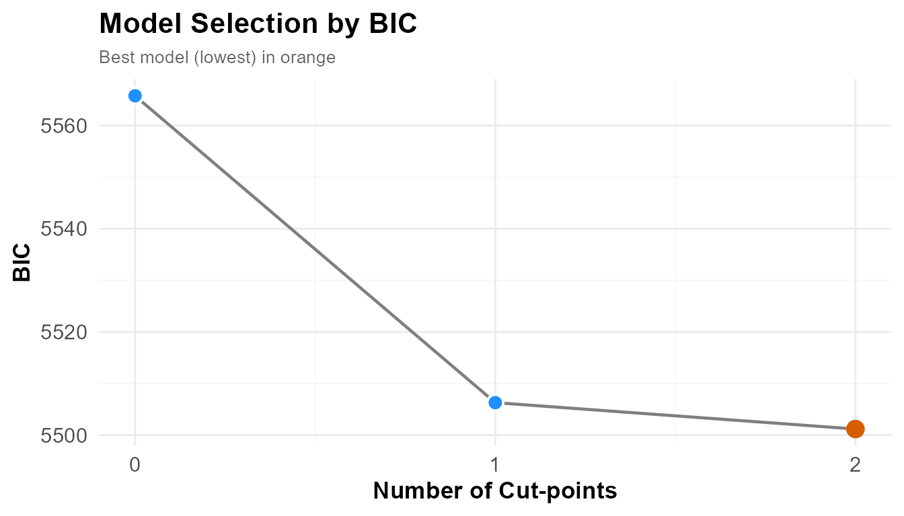
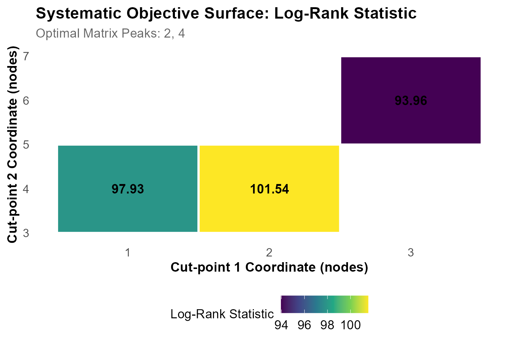
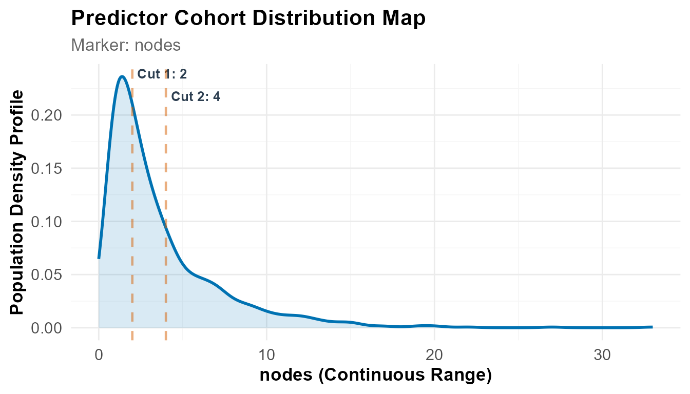
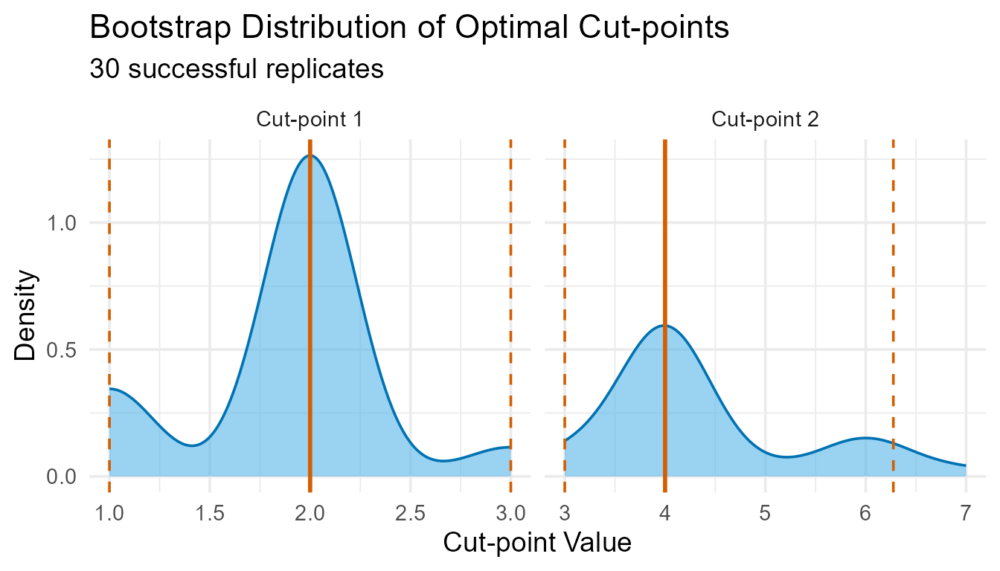
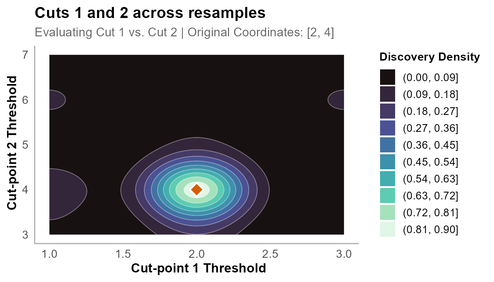
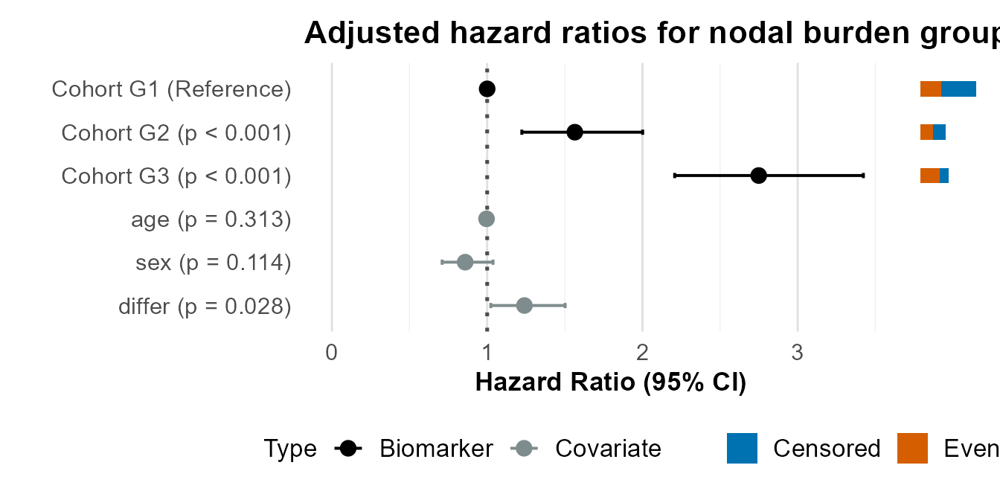
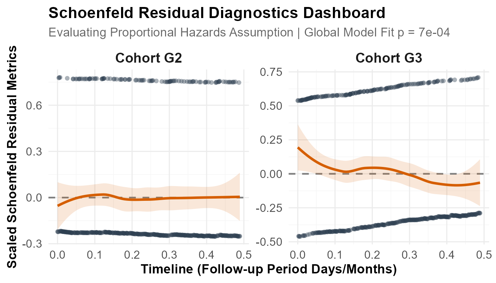
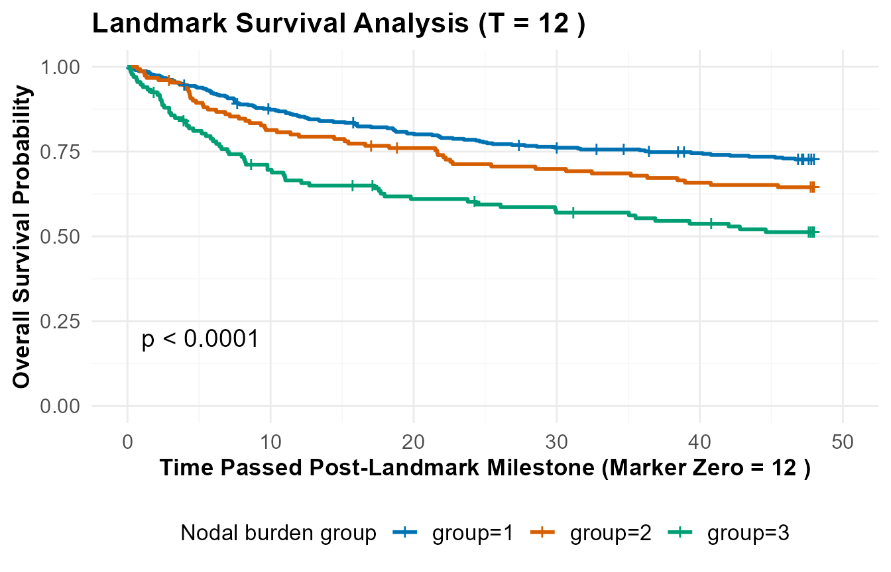
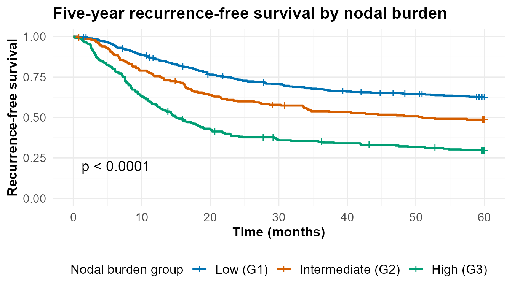

# Thresholds in a Discrete Predictor

## Introduction

The companion vignette applies the workflow to a continuous marker and
arrives at a precise threshold. This one uses a **count**, and does not.

Counts take few distinct values, cluster at the low end, and admit
boundaries only at whole numbers. A threshold cannot shift slightly: it
jumps, and a single step can reassign a large block of patients. This
vignette shows how that behaves in practice and how to report the
result.

### The data

The `colon` dataset comes from two North Central Cancer Treatment Group
trials of adjuvant levamisole and fluorouracil after resection of stage
III colon cancer (Laurie et al., 1989; Moertel et al., 1990). Stage III
means the tumour has spread to regional lymph nodes but not beyond, and
the number of involved nodes is among the strongest predictors of
recurrence.

Staging already uses this count: the AJCC system divides N1 from N2 at
four positive nodes. Here we ask what boundary the trial data support,
adjusting for age, sex and tumour differentiation grade, using
recurrence-free survival capped at five years.

------------------------------------------------------------------------

## 1. Setup

``` r
library(dplyr)
+ 
+ Attaching package: 'dplyr'
+ The following objects are masked from 'package:stats':
+ 
+     filter, lag
+ The following objects are masked from 'package:base':
+ 
+     intersect, setdiff, setequal, union
library(survival)
library(ggplot2)
library(knitr)
library(OptSurvCutR)
+ == OptSurvCutR v0.11.0 ==
+   Docs: <https://github.com/paytonyau/OptSurvCutR>
+   Paper: Yau, Payton (2025) bioRxiv 10.1101/2025.10.08.681246
+   Cite: `citation('OptSurvCutR')`

options(cli.num_colors = 1)
```

``` r

covariates_to_adjust_for <- c("age", "sex", "differ")

# One minimum group size, used at every step
NMIN <- 0.15
```

A single `nmin` value is used at every step. If model selection and
threshold location run under different constraints they search different
spaces, and their results are not directly comparable.

------------------------------------------------------------------------

## 2. Data preparation

The dataset holds **two rows per patient**, one for recurrence and one
for death (`etype`). Modelling both without filtering would treat each
patient as two independent observations.

``` r
data("colon", package = "survival")

analysis_data <- colon %>%
  filter(etype == 1) %>%                      # recurrence records only
  select(patient_id = id, time_days = time, status,
         nodes, all_of(covariates_to_adjust_for)) %>%
  mutate(
    time_months  = time_days / 30.4375,
    status_final = ifelse(time_months > 60, 0, status),   # 5-year censoring
    time_final   = pmin(time_months, 60)
  ) %>%
  select(patient_id, time = time_final, status = status_final,
         nodes, all_of(covariates_to_adjust_for)) %>%
  filter(complete.cases(time, status, nodes,
                        across(all_of(covariates_to_adjust_for))))

nrow(analysis_data)
+ [1] 888
```

This leaves **888 patients** — the number to report, rather than the 929
recurrence records or the 1,858 rows in the raw file.

It is worth inspecting the predictor before searching:

``` r
table(analysis_data$nodes)
+ 
+   0   1   2   3   4   5   6   7   8   9  10  11  12  13  14  15  16  17  19  20 
+   2 269 186 119  83  46  42  38  22  20  13  10  11   7   4   6   1   2   2   2 
+  22  27  33 
+   1   1   1
```

Most patients have one to three positive nodes, and the tail is long and
sparse. Everything that follows is shaped by this distribution.

------------------------------------------------------------------------

## 3. Finding the cut-points

### How many?

BIC is used rather than AIC: a staging rule is confirmatory work, and
BIC penalises additional groups more heavily.

``` r
number_result <- find_cutpoint_number(
  data = analysis_data, predictor = "nodes",
  outcome_time = "time", outcome_event = "status",
  covariates = covariates_to_adjust_for,
  method = "genetic", criterion = "BIC",
  max_cuts = 4, nmin = NMIN,
  max.generations = NULL, pop.size = NULL,
  boundary.enforcement = 2, seed = 123
)
+ ℹ nmin 0.15 is a proportion. Min. group size set to 133.
+ ℹ Finding optimal cut number: method = genetic
+ Running discrete genetic algorithm for 1 cut-point(s)...
+ Running discrete genetic algorithm for 2 cut-point(s)...
+ Running discrete genetic algorithm for 3 cut-point(s)...
+ ! Model with 3 cut-point(s) collapsed: Subgroups violated the minimum 'nmin' constraint of 133 subjects.
+ 
+ Running discrete genetic algorithm for 4 cut-point(s)...
+ ! Model with 4 cut-point(s) collapsed: Subgroups violated the minimum 'nmin' constraint of 133 subjects.

summary(number_result)
+ 
+ ── Optimal Cut-point Number Analysis (Genetic) ─────────────────────────────────
+ ✔ Best Model: 2 Cut-points (Criterion: BIC)
+ ℹ Optimal Thresholds: "2, 4"
+ 
+ ── 1. Model Comparison ──
+  Marker num_cuts     BIC Delta_BIC BIC_Weight    Evidence
+                0 5565.76     64.59         0%     Minimal
+                1 5506.29      5.11       7.2%    Moderate
+       >        2 5501.18      0.00      92.8% Substantial
+ ── 2. Clinical Risk Cohorts ──
+  Group   N Events      Median_CI
+     G1 457    168   NA (NA - NA)
+     G2 202    102 51 (33.6 - NA)
+     G3 229    159 15 (12.6 - 20)
+ ── 3. Cox Proportional-Hazards ──
+    Group    HR Lower Upper P_Value Signif
+  groupG2 1.565 1.223 2.001   0.000    ***
+  groupG3 2.749 2.208 3.423   0.000    ***
+      age 0.996 0.988 1.004   0.313       
+      sex 0.858 0.710 1.038   0.114       
+   differ 1.240 1.023 1.502   0.028      *
+ ℹ Overall Model: Concordance = 0.63 | Log-rank p = 0
+ 
+ ── 4. Time-Dependent Diagnostics (Schoenfeld) ──
+ 
+ ℹ Insight: The hazard ratios appear to fluctuate over time (Global p = 0.000682).
+ The cut-points successfully separate the subjects, but the relative event risk
+ between these cohorts likely evolves as follow-up time increases.
+ 
+ ── 5. Analysis Parameters ──
+ 
+ * Search Method: Genetic
+ * Predictor: nodes
+ * Criterion: BIC
+ * Maximum Cuts: 4
+ * Minimum Group Size (nmin): 133
+ * Covariates: age, sex, differ
```

``` r

plot(number_result)
```



BIC is minimised at **two cut-points**, holding 92.8% of the BIC weight;
the single-cut model is the runner-up at ΔBIC = 5.11 (7.2%).

Larger models return no valid configuration under `nmin = 0.15`, which
requires 133 patients per group. In a separate run with `nmin` lowered
to 0.125 (a floor of 111 patients) the three-cut model completed and was
clearly inferior (BIC = 5510.22, ΔBIC = 9.04). The constraint therefore
excluded a model rather than protecting against a better one, though
this can only be established by testing: a message reporting that
subgroups violated the constraint is not evidence that a configuration
is infeasible.

The Schoenfeld test in this summary already flags a departure from
proportional hazards (*p* = 0.000682), which we return to in section 5.

### Where?

`nodes` takes few distinct values, so an exhaustive search is fast and
exact.

``` r
cutpoint_result <- find_cutpoint(
  data = analysis_data, predictor = "nodes",
  outcome_time = "time", outcome_event = "status",
  covariates = covariates_to_adjust_for,
  num_cuts = number_result$optimal_num_cuts,
  method = "systematic", criterion = "logrank",
  nmin = NMIN,
  n_perm = 100,          # low for build speed; use >= 1000 when reporting
  seed = 123, n_cores = 2
)
+ ℹ nmin 0.15 is a proportion. Min. group size set to 133.
+ ℹ Running regularised systematic search for 2 cut-point(s)...
+ ℹ Searching over 15 candidate positions for 2 cut(s)...
+ ✔ Systematic grid optimisation complete.
+ ℹ Running 100 permutations to calculate adjusted p-value...

summary(cutpoint_result)
+ 
+ ── Optimal Cut-point Analysis for Survival Data (Systematic) ───────────────────
+ ✔ Optimal Threshold(s): "2, 4"
+ ℹ Permutation-Adjusted P-value (100 runs): 0.0099
+ 
+ ── 1. Stratified Risk Cohorts ──
+ 
+  Group   N Events      Median_Time   OS Rate at T=60
+     G1 457    168 NR (Not Reached) 62.6% (58.3-67.2)
+     G2 202    102               51 48.7% (42.2-56.2)
+     G3 229    159               15 29.8% (24.3-36.4)
+ ── 2. Cox Proportional-Hazards ──
+   Group    HR Lower Upper P_Value Signif
+      G2 1.565 1.223 2.001   0.000    ***
+      G3 2.749 2.208 3.423   0.000    ***
+     age 0.996 0.988 1.004   0.313       
+     sex 0.858 0.710 1.038   0.114       
+  differ 1.240 1.023 1.502   0.028      *
+ ℹ Overall Model: Concordance = 0.63 | Log-rank p = 0
+ 
+ ── 3. Time-Dependent Diagnostics (Schoenfeld) ──
+ 
+ ℹ Insight: The hazard ratios appear to fluctuate over time (Global p = 0.000682).
+ The cut-points successfully separate the subjects, but the relative event risk
+ between these cohorts likely evolves as follow-up time increases.
+ 
+ ── 4. Analysis Parameters ──
+ 
+ • Search Method: Systematic
+ • Predictor: nodes
+ • Number of cuts: 2
+ • Minimum group size (nmin): 133
+ • Covariates: age, sex, differ
+ • Permutations: 100
```

The thresholds are **2 and 4 positive nodes**:

| Group             | Nodes |   N | Events | Median RFS  | 5-year RFS        |
|:------------------|:------|----:|-------:|:------------|:------------------|
| G1 (Low)          | 1–2   | 457 |    168 | Not reached | 62.6% (58.3–67.2) |
| G2 (Intermediate) | 3–4   | 202 |    102 | 51 months   | 48.7% (42.2–56.2) |
| G3 (High)         | ≥ 5   | 229 |    159 | 15 months   | 29.8% (24.3–36.4) |

Adjusted hazard ratios are 1.57 and 2.75 relative to G1. Among the
covariates only differentiation grade is independently associated with
recurrence (HR = 1.24, *p* = 0.028). Concordance is 0.63 — real but
moderate discrimination.

Note that G1’s five-year survival is 62.6%, not 58.3%; the lower figure
is the confidence bound. The permutation *p* of 0.0099 is exactly
1/(100+1), the floor for `n_perm = 100`.

``` r

plot(cutpoint_result, type = "surface")
```



Because the search was exhaustive, every evaluated pair is retained. A
broad bright region rather than a sharp peak indicates that many
threshold pairs score almost as well as the winner — an early sign that
the boundaries will not be stable.

``` r

plot(cutpoint_result, type = "distribution")
```



The thresholds are overlaid on the distribution of node counts. The
contrast with a continuous marker is visible here: values stack at each
integer, so the boundaries fall between discrete columns rather than
within a smooth density.

------------------------------------------------------------------------

## 4. Stability

``` r
validation_result <- validate_cutpoint(
  cutpoint_result = cutpoint_result,
  num_replicates = 30,      # reduced for build speed; use >= 500 when reporting
  n_cores = 2, seed = 123
)
+ ℹ Using random seed 123 for reproducibility.
+ ℹ Bootstrap `nmin` not set. Using 119 (90% of original) to improve stability.
+ ℹ Validating 2 cut(s) from 'systematic' search using 'logrank' over regularised coordinate lattice.
+ ℹ Running 30 replicates on 2 cores...
+ ✔ 30 replicates completed.

summary(validation_result)
+ Cut-point Stability Analysis (Bootstrap)
+ ----------------------------------------
+ Original Optimal Cut-point(s): 2, 4 
+ 
+ Bootstrap Distribution Summary
+ -----------------------------
+       Cut  Mean    SD Median Q1 Q3
+ 25%  Cut1 1.867 0.507      2  2  2
+ 25%1 Cut2 4.367 0.999      4  4  4
+ 
+ 95% Confidence Intervals
+ ------------------------
+       Lower Upper
+ Cut 1     1 3.000
+ Cut 2     3 6.275
+ 
+ Validation Parameters
+ ---------------------
+ Replicates Requested: 30 
+ Successful Replicates: 30 / 30 ( 100 %)
+ Failed Replicates: 0 
+ Cores Used: 2 
+ Seed: 123 
+ Minimum Group Size (nmin): 119 
+ Method: systematic 
+ Criterion: logrank 
+ Covariates: age, sex, differ 
+ 
+ 
+ Stability Assessment:
+ ---------------------
+ Maximum CI Width (Relative to 10th-90th Percentile Range): 46.8%
+ ! Model Status: CAUTION (Tier 3)
+ Moderate instability detected (46.8%), and Confidence Intervals overlap.
```

| Tier         | Overlap | Width  | Meaning                               |
|:-------------|:--------|:-------|:--------------------------------------|
| 1 — OPTIMAL  | None    | \< 30% | Precise boundaries, distinct groups   |
| 2 — DISTINCT | None    | Any    | Groups distinct, boundaries move      |
| 3 — CAUTION  | Present | 30–60% | Adjacent groups not cleanly separated |
| 4 — UNSTABLE | Present | \> 60% | Boundaries not reproducible           |

These are two independent diagnostics rather than an ordinal scale, and
the percentages are practical conventions.

``` r

plot(validation_result)
```



``` r

plot_validation(validation_result, focus_cuts = c(1, 2),
                main = "Cuts 1 and 2 across resamples")
```



The resampled boundaries sit on a handful of discrete positions rather
than forming a smooth cloud. This is characteristic of a count
predictor: the boundary can only take whole-number values, so it jumps
between them.

Thirty replicates is sufficient to illustrate the output. With few
replicates the intervals are narrower than they should be, so use at
least 500 replicates for any reported analysis.

### Results at 500 replicates

| Model                       | Threshold(s) | Widest interval | Tier         |
|:----------------------------|:-------------|----------------:|:-------------|
| Two cut-points (BIC choice) | 2, 4         |           42.9% | 3 — CAUTION  |
| One cut-point               | 4            |           57.1% | 2 — DISTINCT |

For the two-cut model the intervals are 1–3 and 3–6. They meet at 3, so
adjacent groups are not cleanly separated. The lower boundary is
reasonably precise at 28.6%; the upper one is not.

Reducing to a single cut-point removes the overlap but not the width:

``` r

cut1 <- find_cutpoint(
  data = analysis_data, predictor = "nodes",
  outcome_time = "time", outcome_event = "status",
  covariates = covariates_to_adjust_for,
  num_cuts = 1, method = "systematic", criterion = "logrank",
  nmin = NMIN, n_perm = 1000, seed = 123, n_cores = 2
)

validate_cutpoint(cut1, num_replicates = 500, n_cores = 2, seed = 123)
```

The threshold is **4 positive nodes** with a bootstrap interval of 2–6.
The median across resamples is 4 and the interquartile range 3–4, so the
boundary is usually recovered, although the tail extends to 2 and 6.
With one boundary there is no separation to assess, so the model is
graded on width alone.

The single-cut model was already the BIC runner-up, and was therefore a
candidate on model-selection grounds before any stability result. This
is worth stating when reporting a simplification made after inspecting
the bootstrap.

------------------------------------------------------------------------

## 5. Reporting and diagnostics

### Group composition

``` r

grouped <- plot(cutpoint_result, return_data = TRUE)

grouped %>%
  group_by(group) %>%
  summarise(
    Nodes    = paste0(min(factor), " - ", max(factor)),
    N        = n(),
    Events   = sum(event),
    Mean_Age = round(mean(age), 1),
    Grade    = round(mean(differ), 2)
  ) %>%
  kable(caption = "Composition of the three nodal burden groups")
```

| group | Nodes  |   N | Events | Mean_Age | Grade |
|:------|:-------|----:|-------:|---------:|------:|
| 1     | 0 - 2  | 457 |    168 |     60.7 |  2.02 |
| 2     | 3 - 4  | 202 |    102 |     59.8 |  2.02 |
| 3     | 5 - 33 | 229 |    159 |     58.0 |  2.19 |

Composition of the three nodal burden groups {.table}

Checking this table before reporting is worthwhile. Mean age is similar
across groups, so the survival gradient is not age acting through node
count. Mean differentiation grade rises with nodal burden, which is why
it is included as an adjustment variable.

### Hazard ratios

``` r

plot(cutpoint_result, type = "forest",
     reference_group = "G1",
     main = "Adjusted hazard ratios for nodal burden groups")
```



The estimates are adjusted for age, sex and differentiation grade, so
nodal burden is not standing in for those. Two qualifications apply:
they were estimated on the same data that selected the thresholds and
are therefore optimistic, and because proportional hazards does not hold
(below) each is an average effect over the 60-month window.

### Proportional hazards

``` r
plot(cutpoint_result, type = "diagnostic")
+ `geom_smooth()` using formula = 'y ~ x'
```



The Schoenfeld test returns global *p* = 0.000682, so proportional
hazards does not hold. The effect of nodal burden is strongest early and
attenuates, consistent with most stage III recurrences occurring within
two years. The grouping remains valid; the hazard ratios should be
described as averages over the 60-month window rather than constant
multipliers.

### Landmark analysis

``` r
plot(cutpoint_result, type = "landmark", landmark = 12,
     legend.title = "Nodal burden group")
+ ℹ Generating Landmark Survival Curve for survivors remaining at time milestone: 12
```



A landmark analysis restarts the clock at 12 months among patients still
event-free. Separation persisting there indicates the groups carry
information beyond early events. This addresses immortal time bias
rather than eliminating it.

### Survival curves

``` r

plot(cutpoint_result, type = "outcome",
     title = "Five-year recurrence-free survival by nodal burden",
     xlab = "Time (months)", ylab = "Recurrence-free survival",
     legend.title = "Nodal burden group",
     legend.labs = c("Low (G1)", "Intermediate (G2)", "High (G3)"))
```



------------------------------------------------------------------------

## 6. Conclusion

Node count separates these 888 patients into three groups with clearly
different recurrence-free survival, at 2 and 4 positive nodes. The
result is highly significant.

The boundaries are not precise. Across 500 resamples the first moves
between 1 and 3 and the second between 3 and 6, and the two overlap.
Reducing to one cut-point removes the overlap but leaves an interval of
2–6 around a threshold of 4.

The conclusion is not that node count fails to predict recurrence, which
it plainly does, but that a discrete predictor with few distinct values
supports a **range** rather than a single value. Recurrence risk rises
somewhere around three to five positive nodes. A rule using four is
defensible; a claim that four is specifically optimal is not.

The data-driven optimum coincides with the AJCC N1/N2 boundary at four
nodes. Given the width of the interval this is best described as
consistent with the staging convention rather than as independent
support for it.

For discrete predictors: tabulate the values first, prefer
`method = "systematic"`, use one `nmin` throughout, expect wide
intervals, and report the boundary as a range when the width is large.

### References

Laurie JA, Moertel CG, Fleming TR, et al. (1989). Surgical adjuvant
therapy of large-bowel carcinoma. *J Clin Oncol* 7:1447–1456.

Moertel CG, Fleming TR, Macdonald JS, et al. (1990). Levamisole and
fluorouracil for adjuvant therapy of resected colon carcinoma. *N Engl J
Med* 322:352–358.

``` r
sessionInfo()
+ R version 4.6.1 (2026-06-24 ucrt)
+ Platform: x86_64-w64-mingw32/x64
+ Running under: Windows 11 x64 (build 26200)
+ 
+ Matrix products: default
+   LAPACK version 3.12.1
+ 
+ locale:
+ [1] LC_COLLATE=English_United Kingdom.utf8 
+ [2] LC_CTYPE=English_United Kingdom.utf8   
+ [3] LC_MONETARY=English_United Kingdom.utf8
+ [4] LC_NUMERIC=C                           
+ [5] LC_TIME=English_United Kingdom.utf8    
+ 
+ time zone: Europe/London
+ tzcode source: internal
+ 
+ attached base packages:
+ [1] stats     graphics  grDevices utils     datasets  methods   base     
+ 
+ other attached packages:
+ [1] OptSurvCutR_0.11.0 knitr_1.51         ggplot2_4.0.3      survival_3.8-9    
+ [5] dplyr_1.2.1       
+ 
+ loaded via a namespace (and not attached):
+  [1] gtable_0.3.6       xfun_0.60          bslib_0.12.0       htmlwidgets_1.6.4 
+  [5] rstatix_1.1.0      lattice_0.22-9     vctrs_0.7.3        tools_4.6.1       
+  [9] generics_0.1.4     parallel_4.6.1     tibble_3.3.1       pkgconfig_2.0.3   
+ [13] Matrix_1.7-6       RColorBrewer_1.1-3 S7_0.2.2           desc_1.4.3        
+ [17] rngtools_1.5.2     lifecycle_1.0.5    compiler_4.6.1     farver_2.1.2      
+ [21] textshaping_1.0.5  codetools_0.2-20   carData_3.0-6      htmltools_0.5.9   
+ [25] sass_0.4.10        yaml_2.3.12        Formula_1.2-6      pillar_1.11.1     
+ [29] pkgdown_2.2.1      car_3.1-5          ggpubr_1.0.0       jquerylib_0.1.4   
+ [33] tidyr_1.3.2        MASS_7.3-66        cachem_1.1.0       survminer_0.5.2   
+ [37] doRNG_1.8.6.3      iterators_1.0.14   abind_1.4-8        rgenoud_5.9-0.11  
+ [41] foreach_1.5.2      nlme_3.1-170       tidyselect_1.2.1   digest_0.6.39     
+ [45] purrr_1.2.2        labeling_0.4.3     splines_4.6.1      fastmap_1.2.0     
+ [49] grid_4.6.1         cli_3.6.6          magrittr_2.0.5     patchwork_1.3.2   
+ [53] broom_1.0.13       withr_3.0.3        scales_1.4.0       backports_1.5.1   
+ [57] rmarkdown_2.31     otel_0.2.0         gridExtra_2.3.1    ggsignif_0.6.4    
+ [61] ragg_1.5.2         evaluate_1.0.5     doParallel_1.0.17  viridisLite_0.4.3 
+ [65] mgcv_1.9-4         rlang_1.3.0        Rcpp_1.1.2         isoband_0.3.0     
+ [69] glue_1.8.1         rstudioapi_0.19.0  jsonlite_2.0.0     R6_2.6.1          
+ [73] systemfonts_1.3.2  fs_2.1.0
```
